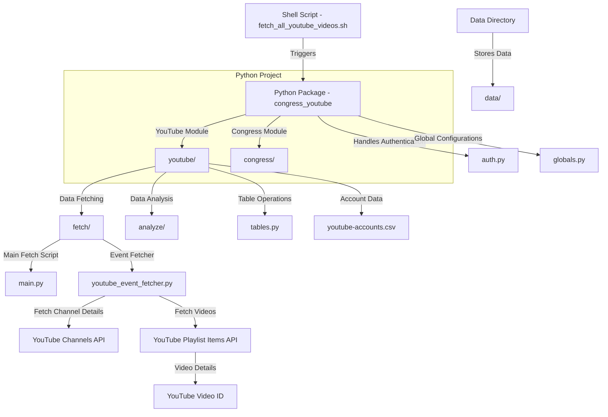

```mermaid
graph TD
    A[Shell Script - fetch_all_youtube_videos.sh] -->|Triggers| B[Python Package - congress_youtube]
    B -->|Handles Authentication| C[auth.py]
    B -->|Global Configurations| D[globals.py]
    B -->|YouTube Module| E[youtube/]
    E -->|Data Fetching| F[fetch/]
    F -->|Main Fetch Script| G[main.py]
    F -->|Event Fetcher| H[youtube_event_fetcher.py]
    H -->|Fetch Channel Details| I[YouTube Channels API]
    H -->|Fetch Videos| J[YouTube Playlist Items API]
    J -->|Video Details| K[YouTube Video ID]
    E -->|Data Analysis| L[analyze/]
    E -->|Table Operations| M[tables.py]
    E -->|Account Data| N[youtube-accounts.csv]
    B -->|Congress Module| O[congress/]
    P[Data Directory] -->|Stores Data| Q[data/]

    subgraph Python Project
        B
        E
        O
    end
```
