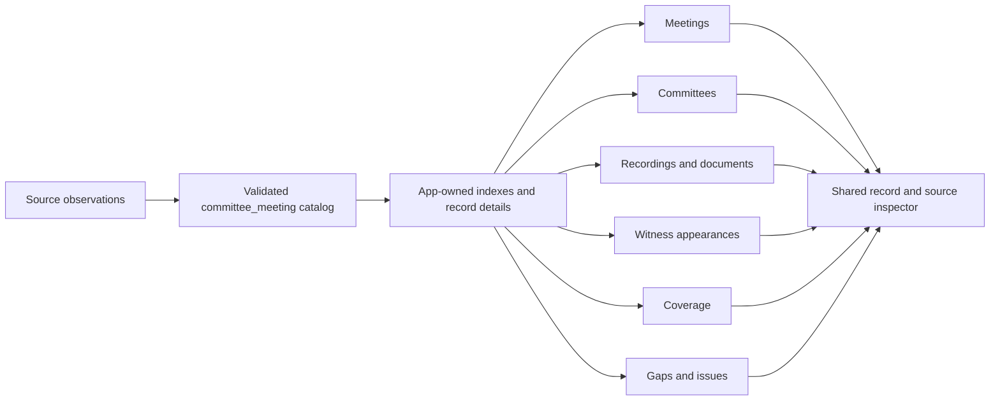

# Congressional Committee Explorer

Status: implemented model, retained-source export and production site integration.
The six real-data workspaces live at `/dashboard/`; the original Event ID report
has its own `/youtube-coverage/` route. The synthetic preview remains a design
reference. See the [execution receipt](../../packages/committee_meeting/INTEGRATION_EXECUTION.md)
for validation and release status. The original design findings below were
reviewed on 2026-09-27 against main `3108a6d` and data snapshot `acc8108`.

Companion artifacts:

- [Data model and source mappings](../../packages/committee_meeting/src/committee_meeting/MODEL.md), schema `0.1.0-draft.2`.
- [Congress API integration proposal](../../packages/committee_meeting/CONGRESS_API_INTEGRATION.md), including source-output repairs needed for trustworthy export.
- [Python model definitions](../../packages/committee_meeting/src/committee_meeting/).
- [Interactive design preview](committee-explorer-preview.html), using explicitly synthetic, model-validated records.

This document owns product behavior, presentation and delivery. The model owns
record meanings, identity, evidence and relationship validation. The preview
tests the interaction direction; it is not a second production implementation.

## Recommendation and findings

Make committee meetings the main entry point. Give each meeting a linked record
of its committees, recordings, transcripts, witness appearances, documents,
amendments, votes and related legislation. Keep YouTube Event ID tracking as a
specific coverage report within the explorer.

This implements the public browsing part of the existing proposal I.1,
“Unified Congressional Hearing & Markup Data Platform.” Proposal I.2 remains
the YouTube metadata capability; its data and useful charts remain available.

| Finding | Evidence | Decision |
|---|---|---|
| The current page exposes one aggregate report, not meeting records. | `apps/site/src/components/dashboard/Dashboard.tsx:48` loads only the YouTube CSV; `data.ts:3` describes aggregate rows. | RESHAPE the product around meeting discovery and detail pages. |
| The summary tables are not a complete public record. | `inventory/completeness.py:53` uses native Congress.gov witnesses but writes only recovered witnesses to `meeting_witnesses.csv`; lines 79–82 reduce documents, locations and related items to counts or flags. | Export native meeting fields and linked source rows as well as summaries. |
| Availability labels need an evidence basis. | `inventory/captions.py:3` explains caption flags and date inference; `common.py:60` excludes cancelled/postponed records from the inventory. | Distinguish found, inferred, not found and unknown; retain source meeting statuses. |
| Publication currently happens before the new meeting outputs exist. | `.github/workflows/update-data.yml:64` dispatches deployment in the YouTube job; the meeting outputs are saved at line 162. | Publish the explorer after the data jobs finish, with explicit input versions and freshness. |
| There is already a broader product proposal. | `apps/site/src/content/proposals/I.1.md:17` specifies dates, committees and links to videos and transcripts. | Extend this product rather than create a separate competing dashboard. |

## Retained data reviewed for this design

These measurements describe retained records, not unique people or unique files:

| Input | Current scope |
|---|---:|
| Congress.gov meeting export | 18,139 records |
| Derived meeting inventory | 17,606 eligible records |
| Native witness appearances within that inventory | 35,675 rows |
| Recovered witness appearances | 18,495 rows |
| GPO hearing packages | 34,559 rows, including 178 errata |
| House amendment/vote attachments | 13,231 amendment rows; 6,754 vote rows |
| House and Senate additional document tables | 18,126 and 14,407 rows |

The native meeting records additionally contain meeting documents, witness
documents, videos, full locations, related items, committee affiliations and
source update dates. The 17 app CSV files total 49,627,930 bytes. Their scopes
overlap; summing their row counts would double-count material.

The broader GPO collection predates the modern meeting inventory. Unmatched
prints and recordings must remain discoverable in their own views, with an
explicit “Meeting not linked” state. A missing relationship must not cause a
source record to disappear.

## Product structure

Use **Committee Explorer** in navigation and **Congressional Committee
Explorer** as the page title. Keep `/dashboard/` as a working entry point.
Update the project description and proposal links to explain the expanded scope.

| View | Main task | Information shown |
|---|---|---|
| Meetings — default | Find a proceeding and its records. | Date/time, title, chamber, committee/subcommittee, type, status, recording and text availability, witness/document counts. |
| Committees | Follow one committee across Congresses. | Names and codes, subcommittees, source sites/channels, meetings, materials and coverage over time. |
| Recordings & documents | Find material directly, including unlinked records. | Videos, printed transcripts, committee transcripts, caption observations, statements, biographies, disclosures, supporting documents, amendments and votes. |
| Witnesses | Find appearances by name or organization. | Name, role and affiliation as recorded for that appearance, meeting, source and testimony links where the association is supported. |
| Coverage | Understand what is available and what remains uncertain. | Separate recording, transcript, caption, witness and document measures; existing YouTube Event ID charts; source coverage and freshness. |
| Gaps & issues | Find known limitations and inspect corrections. | Missing expected material, checks not performed, unresolved links, conflicts, confirmed errors, stale sources and issue history. |

Downloads and methodology are available from every view. Shared filters include
Congress, chamber, committee/subcommittee, date range and meeting type. Each view
adds relevant filters, such as document type, format, caption basis or
organization. Keep selections in the URL so results can be shared and revisited.
Default to the current Congress while making all available periods explicit.

A meeting detail page begins with an availability and limitations summary,
then provides:

1. Title, source IDs, date/time, status, location and every associated committee.
2. **Watch and read:** every linked recording and text source, identifying full
   recordings, clips, printed transcripts and captions separately.
3. **Witnesses:** appearances, affiliations, panels and recorded roles when known.
4. **Documents:** statements, questions for the record, biographies, disclosures,
   reports and other attachments, grouped by their actual type.
5. **Amendments and votes:** bill references, local amendment numbers, sponsor IDs,
   en-bloc grouping and source files where recorded.
6. **Gaps & issues:** open findings, their impact, evidence, last check and
   correction history. No open issue does not mean complete or verified.
7. **Related legislation and sources:** bill links, source pages, update markers,
   observed discrepancies and additional provider fields.

Metadata search covers titles, identifiers, witness names, organizations and
related bills. Full-text transcript search requires a separately published text
corpus; a transcript link alone does not provide it.

## Relationships and identity

The meeting is the principal navigation record, but relationships are many-to-many:

- A meeting can involve several committees and subcommittees.
- One recording or printed volume can cover several proceedings or dates.
- One file can appear in several sources and serve several meetings.
- One person can appear repeatedly, with different roles or affiliations.

Keep source meeting IDs, committee codes with Congress context, GPO package IDs,
video IDs and original source URLs. Record the source and method for each link.
Preserve distinct provider records even when the interface groups them.
Deduplicate demonstrably identical files separately from the records describing
them. A document URL and a meeting-document relationship are different things.

Model a witness appearance before attempting a global person directory. Do not
join people solely by normalized name. Use a supplied identifier, such as a
Bioguide ID, when available; otherwise show name-based search results as
appearances. Do not infer that a witness testified merely from being listed.

Keep all public provider fields accessible in source details/downloads, even if
they do not have a dedicated column. Document any fields omitted from publication.
Parser caches and operational state are not the public record.

## Model-to-interface mapping

Use `committee_meeting` records throughout the exporter and site. Keep one
meaning for a meeting, appearance, material and file across all six views.
The Python model owns these meanings; UI indexes are smaller derived records.

| Workspace / section | Model records | User-visible behavior |
|---|---|---|
| Meetings list | `Meeting`, `MeetingOccurrence`, `CommitteeTerm`, `Assessment` | One row per meeting; all conveners, date range/occurrence count, separate recording/text findings. Two sittings do not become two meetings. |
| Overview | Meeting, occurrences, `MeetingRelation`, `MeetingSubject` | Distinguish scheduled/actual dates and access. Show postponed/cancelled records, related bills and replacement entries. |
| Committees | Committee, terms, relations, memberships, channel associations | Congress changes historical name/hierarchy/membership context. Member channels remain distinct from official channels. |
| Watch and read | `MaterialLink`, material, versions, representations, material relations | Group material → edition → formats. Printed transcripts remain independent of recordings; retain alternate text sources. |
| Witnesses | Appearance, panel, optional person/organization, material links | Count appearances and show recorded affiliations. Name search does not create a person profile or assert testimony occurred. |
| Amendments and votes | Amendment, group, vote, legislative item, material links | Scope local actions to their meeting. Missing attachment, tally or result stays unknown. |
| Material detail | Material, versions, representations, incoming links | One item can serve several meetings. Unlinked archives remain searchable using their own dates, Congress and chamber. |
| Source inspector | Provenance, field evidence, source record, assessment | Selected/alternative values, supporting source, basis, method and actual observation date. |
| Coverage | Coverage metric, assessments, manifest inputs | Stated unit/population, observed versus inferred evidence and source freshness. YouTube Event ID coverage remains its own measure. |
| Gaps & issues | `DataIssue`, assessments, field evidence and manifest limitations | Affected records/fields, supported expectations, impact, lifecycle and resolution evidence. Issue counts are separate from coverage denominators. |



Preserve distinct provider meeting entries. `same_proceeding` does not silently
merge them or move witnesses. Keep identity, metadata and file deduplication
separate. A complete `Catalog` validates references before partitioning;
individual detail files can reference records outside their file.

## Frontend direction

**Visual thesis:** a calm civic research workspace with a compact midnight
header, light reading surface, precise typography and restrained gold accent.
The result list and selected record are its visual anchors.

**Content plan:** orientation/search → filtered results → record detail →
watch/read, follow related records or export. Begin with the working surface,
without a marketing hero or KPI-card mosaic.

**Interaction thesis:** retain filter context as users scroll; reveal selected
records without losing results; disclose source evidence on demand. Use the
site's 200–300 ms easing for selection, detail entrance and evidence disclosure.
Honor reduced motion, preserve focus and avoid layout jumps.

### Keep the original dashboard's useful graphics

The [original YouTube dashboard](https://civictechdc.github.io/congressional-tech/dashboard/)
uses an Event ID donut, stacked columns by Congress, and horizontal committee
bars. Retain those visual forms in Coverage, with a specific question and
counting rule for each. The existing React implementation in
`apps/site/src/components/dashboard/Dashboard.tsx` uses small SVG/HTML charts;
the explorer does not need a new charting library.

| Graphic | Explorer use | Meaning and limit |
|---|---|---|
| Donut and adjacent counts | One selected measure: linked printed text, recordings or recorded witness lists | State the numerator and eligible population. Keep unchecked/failed/inferred states distinct where inputs support them. Never present an overall completeness score. |
| Stacked columns | Compare the same measure by Congress, or by meeting date within one Congress | Count distinct meeting records once, even with several sittings. Date groups describe the archive distribution, not improvements between collection runs. Missing date groups remain visible. |
| Horizontal committee bars | Compare availability and unknowns across committees | Use a common scale and show counts beside rates. Shared meetings may appear under several hosts, so committee rows are not additive. Avoid a quality ranking based on volume. |
| Source/check matrix, when supported | Compare source families and collection periods | Show never collected, failed checks, stale observations and unsupported periods explicitly. Add this when source manifests supply those facts; empty cells do not mean zero. |

Coverage gets a compact count row and two adjacent charts above a full-width
committee comparison. Keep the open canvas, restrained dividers and existing
site typography. Individual meeting pages remain focused on their records;
aggregate graphics belong in Coverage and scoped committee summaries.

Use primary blue for recorded links, gold for a supported unsuccessful check,
and gray hatching for an unestablished result. Keep labels and exact counts
visible so color is not the only signal. Inferred, failed, blocked and excluded
populations need their own explicit labels when present; do not hide them in a
binary available/missing split. The gold Event ID segment in the legacy report
still means “description has no Event ID,” which is a narrower claim than “video
has no meeting association.” Each report retains its own legend.

All charts share the active search and chamber filters. Changing the measure
updates the donut, columns, committee bars and table together. Clicking a count
opens its records with the metric, evidence state and group preserved in the
URL; browser Back restores the chart context. Provide a keyboard-accessible
table for every comparison, explicit zero/empty states, and a local scroll
area for wide tables on small screens. Exports state the selected population.

Preserve the original Event ID report, including its Congress, chamber and party
control filters, under Coverage. Party control remains a descriptive filter for
that report; it is not a cause inferred from a chart. Reuse the report's video
population and metadata instead of substituting meeting counts. Chart freshness
comes from the underlying source checks, not the time the page was rendered.

The synthetic preview implements the donut, weekly columns, committee bars,
measure selector, linked counts and accessible tables. It keeps the live Event
ID report one link away, without mixing its real video totals into sample meeting
counts. Production Congress comparisons and source matrices require the real
export and reconciled populations.

Use `apps/site/src/styles/tokens.css`: midnight structure, white/canvas surfaces,
primary blue actions, gold active navigation/focus and muted text. Keep Source
Sans 3 / Source Code Pro. Gold reinforces focus or active navigation rather
than carrying small text on white. Status always has a text label. No decorative
imagery is needed; real recording thumbnails can help identify actual material.

### First viewport and responsive layout

The first viewport contains a compact heading, six workspace links, search and
filters, result count and visible records. Counts belong beside their result
set, with methodology and freshness close to the findings they qualify.

```text
 CIVIC TECH DC / Committee Explorer                    Sources & downloads
 Meetings  Committees  Recordings & documents  Witnesses  Coverage  Gaps & issues
 ────────────────────────────────────────────────────────────────────────
 Search title, witness, organization or bill…          Congress   Chamber
 Meeting type     Text availability       More filters       Clear
 142 meetings · date descending                           Export results
 ────────────────────────────────────────────────────────────────────────
 DATE       PROCEEDING / COMMITTEES                  RECORDS
 Sep 24     Hearing title                           Video · Printed text
            Committee / Subcommittee                4 appearances
 Sep 23–24  Multi-day hearing                       Captions inferred
            Joint conveners                         2 sittings
```

These numbers illustrate layout, not measured production counts.

At wide desktop widths, detail can open beside results with a divider and a
shareable URL. At intermediate widths, detail takes the content area with
“Back to results”. At narrow widths, stack date/title/committee/availability
within each result, move optional filters into a labelled disclosure and open
detail at full width. Preserve fields in detail rather than squeezing every
column into a horizontally scrolling table.

Use semantic lists/tables with real heading links, not click-only rows. Separate
record selection from opening files. Provide a skip link, visible focus, labelled
controls and polite result-count announcements. Dialog inspectors trap focus,
close with Escape and restore their opener. Keep touch targets usable.

### Record detail

| Area | Display and action |
|---|---|
| Heading/schedule | Title or honest ID fallback, all committees, Congress, occurrences, access/status. No invented times for date-only values. |
| Watch and read | Material rows with source, edition and formats. PDF/HTML/XML of one edition count as one material. |
| Participants | Panels, historical affiliations, listed/testified status and linked statements. Person links require identity evidence. |
| Documents | Group by category and show supported appearance/action links, including questions and responses for the record. |
| Amendments/votes | Number, target, sponsor, en-bloc membership, known disposition and material. Do not invent roll calls. |
| Sources | Provider links, source-check/import dates, disagreements and additional public fields. Open the precise supporting observation from evidence labels. |

For a shared print, show links to the other meetings it covers. Pin page/time
portions to an exact representation. Select an edition before showing its file
formats; never offer guessed formats. Preserve earlier editions. Prefer a
current publisher edition only when evidence supports that choice; otherwise
label the available editions without claiming which is current.

### Evidence vocabulary

| Model condition | UI wording | Action |
|---|---|---|
| Publisher advertises a representation | “Listed by source” | Open its recorded location; do not imply retained bytes. |
| Available, observed assessment | “Confirmed · checked [date]” | Show check scope and source. |
| Available, inferred assessment | “Captions inferred” | Explain method; no download/search affordance without actual text. |
| Unknown or inadequate observation | “Not checked” or “Unknown”, as supported | Show known context; never substitute “None”. |
| Dated/scoped negative | “Not found in [scope] · checked [date]” | Explain the limited finding. |
| Blocked/error | “Could not check” | Preserve earlier usable material with its own dates. |
| No matched meeting | “Meeting not linked” | Keep the material discoverable. |
| No reliable retrieval date | “Source check date unknown” | Keep import date separate. |
| Empty filter result | “No records match these filters” | Clear filters. |
| Dataset/detail load failure | “Records could not be loaded” | Retry and preserve state; never render zero coverage. |

`not_applicable` explains eligibility. Cancelled, closed and future meetings stay
visible; coverage measures state their own populations. Avoid one red/green
“complete hearing” score that combines incomparable evidence.

### URLs and exports

Keep `/dashboard/` under Astro's configured base path. Store workspace, Congress,
chamber, search, type, availability, sort and selection in query parameters.
Use separate `kind` and `id` parameters; URL-encode opaque IDs. For example:
`/dashboard/?view=meetings&congress=119&kind=meeting&id=…`.
Record selection and committed filters create history entries; typing may replace
the current search entry. Back restores filters, selection and result position.
Unknown record IDs get an explicit state, never an unrelated record. Sharing
preserves the selected occurrence/edition. Direct URLs must work on static hosting.

Exports state publication ID, filters, counting unit and selected record IDs.
Separate normalized metadata from source files. Full-text search and transcript
downloads appear only when their corpus/representation is actually published.

## Make limitations a first-class part of the record

Confidence comes from showing both what is supported and where support ends.
Every record needs an understandable answer to four questions: what do we have,
what did we check, what remains unknown, and what is known to need correction?
Neither a green indicator nor an empty issue list can establish completeness.

Use three complementary outputs: `Assessment` records a particular check,
`DataIssue` records a supported limitation/correction, and manifest inputs plus
`SourceScope` state the archive's coverage and acquisition limits. Source scopes
can describe a family never collected without inventing an input artifact. Ordinary null fields do
not automatically become defects. A missing item requires evidence that it was
expected; future/cancelled/closed meetings are not automatically publication failures.

| Finding | Required explanation | Example |
|---|---|---|
| Missing expected item | What was expected, why, where/when checked | Publisher lists a statement; its attachment is unavailable at the dated check. |
| Unverified / not checked | Which check has not established a fact | Witnesses are listed, but attendance has not been verified. |
| Unresolved association | Candidate/scope and why evidence is insufficient | Archive recording remains unmatched to a meeting. |
| Conflicting values | Both observations and why a display value was selected | Calendar and printed transcript report different dates; neither is declared wrong without evidence. |
| Incorrect value | Evidence demonstrating the error and affected use | Scheduled time was incorrectly presented as actual convening time. |
| Stale source | Last successful observation and the refresh/age rule | Publisher updated after the last successful attachment check. |
| Suspected duplicate | Records and evidence requiring identity review | Two source entries may describe one proceeding; counts still treat them as provider entries. |
| Resolved / dismissed | Dated decision, explanation and supporting evidence | A bad date was corrected; original finding remains in history. |

Put open findings near the record heading and retain a “Gaps & issues” section
with scope, category, effect on use and source links. Offer an explicit
“Include resolved” view. The archive workspace filters by category, impact,
source, Congress/committee, check age and lifecycle state. Show affected-record
counts as well as issue counts because one record can have several issues.
Do not sum overlapping categories into an overall confidence percentage.

Coverage must expose the coverage of the checks themselves: supported,
inferred, successfully checked but not found, unchecked, failed/blocked and
outside scope. Define disjoint counting rules for each measure and show its
eligible population. Source families/periods never collected appear in a scope
table with their known limitations, not as zero records. A source outage is a
source-level limitation unless there is evidence of an affected record.

These are concrete concerns in the existing acquisition code, not hypothetical
warnings. The integration review found import dates stored as legacy check
dates, caption negatives that can include request failures, and transcript
context that can contain another hearing's roster or scheduled start time.
See the companion integration proposal for exact source citations and repairs.
Until repaired, preserve those values as source evidence without promoting them
into verified freshness, absence, attendance or actual time.

Persist issue identity by subject, field and detection rule. Repeat checks update
the existing issue. A disappearing source row, failed refresh or changed filter
does not resolve an issue. Resolution requires new evidence or an explicit
recorded decision. The public Explorer displays that lifecycle; issue authoring
and moderation remain outside this initial read-only site scope.

## Data ownership and publication

Retain the current static Astro site, React interactions and site design tokens.
The approved site design already uses static output and an interactive island
(`apps/site/DESIGN.md:26`). This scope does not require a service or database.

The proposed flow is:

```text
Congress.gov records + House/Senate outputs + GPO + video/caption metadata
                              ↓
      source adapters → committee_meeting records + source observations
                              ↓
      app exporter → Catalog validation, reconciliation and issue lifecycle
                              ↓
       manifest + indexes + record details + source details + issues
                              ↓
                   static site and downloads
```

| Component | Owner | Responsibility |
|---|---|---|
| Fetching, parsing, source matching | Existing `congress_api` and `youtube_api` packages | Preserve the source rules and refresh behavior. |
| Shared record definitions | `packages/committee_meeting` | Own identity, evidence and relationship validation; import no source package or frontend. |
| Weekly job composition | Existing application/workflow | Select input snapshots and publish successful outputs. |
| Public data export — new | Application layer | Join existing results, retain provenance, check relationships, produce display data and downloads. |
| Explorer pages | `apps/site` | Search, filter and render; never reproduce acquisition or matching rules. |

Generate consumer types from the approved model schema rather than maintaining
another handwritten domain definition. App-specific indexes declare their own
versions and keep record/evidence refs so a summary always leads to its basis.

| Artifact | Contents | Loading |
|---|---|---|
| Manifest | Input/output identities/digests, source scope/freshness, limitations and partition inventory | First; pin subsequent requests to one publication. |
| Index by Congress/view | Typed refs, searchable labels, occurrence dates/status, derived counts and availability/issue summaries with evidence refs | Selected view/scope only; no native payloads or transcript bodies initially. |
| Record detail | Records and related refs, appearances/actions, editions/formats, issue summaries and evidence refs | On selection. Resolve outgoing refs through published indexes/paths. |
| Source detail | Public retained payload/artifact, citations and field alternatives | On evidence disclosure. |
| Issue index/detail | Affected refs, category, impact, state, check date and resolution | Per workspace/record; source-wide limits remain separately visible. |
| Text corpus, when published | Existing transcript body schema and optional speaker attribution | Separate reading/search payload. |

Validate the complete catalog before partitioning. A detail file with outgoing
references is not itself a complete catalog. Check selectors and file hashes
against real retained artifacts; model validation alone cannot establish them.
Count deduplicated typed IDs after following supported links, never the sum of
overlapping arrays. Preserve observed and inferred evidence in mixed summaries.

The exporter reads both the native meeting export and derived tables. It uses
existing source decisions rather than independently matching people, documents
or recordings. The current preferred `text_source` is a summary, not a reason to
discard other available sources (`inventory/captions.py:63`).

Produce a small manifest and summary, indexes partitioned by Congress, and
meeting/material detail files loaded when requested. Build them as deployment
artifacts; do not commit large generated bundles or restored caches to `main`.
Keep data state on `pipeline-data` and source-derived tables in their established
locations. Measure initial transfer size, filtered search latency and build time
before deciding whether finer partitions or a dedicated search service are needed.

The deployment should pin its input commit IDs and include schema version,
generation time, per-source coverage periods and available observation dates.
Publishing time is not the time a source was checked. Imported cache dates must
not be presented as fresh live checks.

Run publication after the data jobs settle. If a source job fails, retain its
last successful outputs and identify that freshness in the manifest. If export
validation fails, leave the previous site deployed. Preserve the existing rule
that committee failures do not stop upstream GPO/video results from being saved.

## Implementation sequence and preview scope

### Frontend data-source boundary

Inject the data source at page startup. The renderer consumes normalized domain
records through `ExplorerReader` (or `ExplorerDataSource` for bounded previews);
fetching, file discovery, decoding and
format conversion belong to the adapter. The local implementation and interface
are in `apps/site/src/components/explorer/data-source.js` and `.d.ts`, documented
in that directory's README. The preview now calls `mountExplorer({ source })`.

The JSON publication adapter follows `CURRENT` to the manifest, selects a
complete catalog by role/schema, selects its decoder by `media_type`, and checks
manifest/data checksums, schema and record count. A Parquet adapter must produce
the same record identities, date precision, null meanings and evidence. Changing
encoding should not change charts, filters or source inspectors. Keep decoder
dependencies out of the UI bundle until the selected source needs them.

The bounded preview loads one complete snapshot. For the real archive,
`openPublicationReader` provides `search`, `getRelated`, `getRecord`, `getRecords`
and filtered `getCoverage`. It pins one manifest, follows sharded record locators, validates
each requested artifact and caches a small number of completed files. A record
and its cited source can be fetched without downloading the complete catalog.
Query pages are scoped by kind and Congress; results are filtered before pagination.
Coverage uses the same selected meeting population and published evidence states. The
interface expresses user queries and domain results, not filenames, SQL or
Parquet row groups. The source interface
uses `catalog.generated.d.ts`, generated from the Python model by
`npm run generate:explorer-types`; its check command detects schema drift.
No global dependency-injection framework is required.

The first full retained-data check covered 18,139 meeting entries. Its 9.6 MB
index motivated scoped query pages, gzip artifacts and paginated results. The
production distribution excludes the complete Catalog and legacy index. The
[integration execution receipt](../../packages/committee_meeting/INTEGRATION_EXECUTION.md)
pins the tested release and records the data and publication limits.

The existing React dashboard also receives a `CoverageReportSource` through its
`source` prop; its wrapper chooses the CSV adapter within the hydrated island.
That avoids passing functions across Astro's server/client serialization boundary.
Both loaders support cancellation and expose failures instead of fabricating
empty results. Publication, data-source and UI behavior are tested separately.

### Adoption sequence

1. Land the draft model and agree on identity/evidence/issue rules. Expand owner
   outputs that lose alternate full URLs or check/matching evidence.
2. Build a bounded app exporter from retained inputs; persist identities and
   issues, reconcile populations, validate references, selectors and manifests.
3. Add an Explorer shell, filter bar, result list, record detail, material list
   and evidence inspector in `apps/site/src/components/explorer/`. Reuse existing
   coverage charts. Render actual exports rather than creating another data layer
   from the preview's convenience joins.
4. Exercise keyboard/mobile use, direct URLs, Back, failures and corrections.
   Measure realistic payload/build costs and set explicit budgets. Update the
   site design/navigation/project copy as part of actual adoption.
5. Sequence publication after data jobs and verify public bytes against the manifest.

The adjacent preview demonstrates six workspaces, search/chamber filters,
coverage charts and record drill-downs, details, editions/formats, unresolved
appearances, known issues, corrections and evidence disclosure. Its fixture is
synthetic and validates against the Python
model. Sample file URLs are illustrative; no live media is claimed. The preview
does not establish full-data reconciliation, production performance or deployment.

Regenerate its fixture with the package dependency installed, then serve the
repository root locally:

```sh
python docs/youtube-coverage/committee-explorer-preview.py
python -m http.server 8769 --bind 127.0.0.1
```

Open `/docs/youtube-coverage/committee-explorer-preview.html` on that server.
The preview imports existing site tokens; it needs no frontend build or network
acquisition. Export results downloads only the filtered synthetic metadata.

## Invariants and acceptance criteria

| Commitment | Status in proposal | Check |
|---|---|---|
| Static site with bounded client work (`apps/site/DESIGN.md:26`) | Preserved | Initial view loads only its summary/index; detail data loads on demand. |
| State stays off `main` (`apps/committee_youtube/README.md:33`) | Preserved | Generated detail bundles and restored state are absent from code history. |
| Source packages own acquisition and matching (`inventory/main.py:15`) | Preserved | Browser/export code does not introduce competing source-match decisions. |
| Upstream outputs survive committee failures (`update-data.yml:116`) | Preserved | Failed reader test still saves upstream output and retains a usable published site. |
| Availability and evidence are separate | Explicit new publication rule | Captions inferred by date, unknown captions, missing links and unavailable text remain distinguishable. |

Acceptance examples:

- Every indexed meeting opens to its exact source record, without requiring a
  video or printed transcript to exist.
- Native and recovered witness lists reconcile by meeting; the 18,495-row
  recovered table is never presented as the complete witness collection.
- Cancelled, postponed, rescheduled, future and closed records remain visible
  with their status. Coverage denominators explain which records they include.
- Blank or unchecked fields render as unknown. A dated unsuccessful search is
  labelled “not found,” not proof that the record does not exist.
- Joint meetings and shared prints do not inflate unique resource counts or
  copy one meeting's witnesses into another.
- All available transcript/recording sources remain visible even when a preferred
  text source is selected. An inferred caption badge cannot claim downloaded text.
- Material types distinguish transcripts, statements and questions for the record.
  PDF/XML availability comes from recorded source evidence, not suffix guessing.
- A record without a download URL remains listed without a fabricated link.
- All resource links either resolve within the export or explicitly identify an
  unlinked source record. Users can download the current filtered results.
- Keyboard navigation, small-screen layouts, filter URLs and browser Back work.
- Counts and source versions reconcile before deployment, and the public files
  are checked against the generated artifact after deployment.
- Known issues appear alongside available material; unchecked does not become
  absent, conflicting does not become incorrect, and no open issues does not
  become verified completeness.
- Missing-item findings state why the item is expected. Resolved findings retain
  original evidence and dated correction decisions across refreshes.
- Coverage exposes unchecked/failed/out-of-scope populations and its denominator;
  issue counts cannot masquerade as a confidence score.
- Format changes preserve material counts; page references remain pinned to an
  edition/file. Same-name appearances remain separate without identity evidence.
- Source-detail failures preserve the selected record. Inspectors restore focus,
  direct links work under the site base path, and reduced motion is honored.

## User value and alternatives

The target users are staff, researchers and members of the public who need to
find a proceeding, identify participants, and reach its supporting records.
Three concrete tasks should drive usability checks: find a committee's recent
hearings with readable text; find an organization's witness appearances; and
locate a markup's amendments and vote files.

A renamed chart page would preserve the current aggregate input but would not
support those tasks. A generic viewer of the 17 CSVs would expose columns while
making users reconstruct relationships and duplicate records themselves. A new
server/search stack is not justified until measured static-export limits or
full-text requirements demand it.

The smallest useful implementation is one exporter, a searchable meeting list,
meeting detail pages, and the existing coverage report under the broader name.
The other views should be alternative ways of navigating that same exported
record model, not separate datasets with their own source rules.

## Counterfactuals and verdict

- **Kill criterion:** if users mainly need an API or bulk download and do not use
  linked browsing to complete the three tasks, prioritize export/downloads over
  additional interface views.
- **Removal probe:** removing the new exporter must leave acquisition and existing
  source tables intact. Only the explorer publication should be affected.
- **Sibling overlap:** proposal I.1 already describes the broader platform.
  Evolve it and retain I.2's specific metadata work inside it; do not create a
  third competing product. Bill tracking remains with the relevant existing
  proposals/subprojects; this explorer links related bills.
- **Likely six-month failure:** the interface reports fresh totals from stale or
  incomparable sources, or unlinked records disappear. Source-specific freshness,
  stated denominators and relationship checks directly address that risk.

Verdict: **RECONSIDER the current product scope; reshape the YouTube dashboard
into the meeting-centered explorer.** The current implementation matches its
original YouTube purpose but does not cover the expanded user need. The
user-value case is supported by the existing proposal and retained records.
Storage and ownership commitments are preserved, and the shared export reduces
the risk of competing source rules. There is partial overlap with proposal I.1;
the explorer implements its public-browsing capability. Preserve the acquisition
pipeline and static site and add an explicit public-data export. Confidence is
high in the product/data direction; payload budgets and rendering choices still
require a measured prototype.
