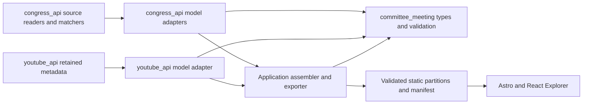

# Integrating Congress data with the Committee Explorer model

**Status: locally implemented and validated, 27 September 2026.** Source adapters,
owner evidence repairs, immutable export, browser queries, persistent issue
history, publication workflows and typed injectable readers are in the
production checkout. Read the [execution receipt](INTEGRATION_EXECUTION.md) for
complete retained-input reconciliation, compatibility checks, measured limits
and the remaining public-release boundary. The design rationale below records
the original proposal; no deployment is claimed.

## Decision

Keep `committee_meeting` as the shared metadata model. Make `congress_api`
produce that model through small, offline adapters, and let the application
assemble and publish the complete dataset. Keep acquisition, source parsing,
refresh schedules and existing matching rules with their current owners.

This gives the Explorer meetings, materials, appearances, legislative actions,
evidence and known problems without making the model package depend on HTTP,
TinyDB, YouTube, PDF parsing or transcription services. Moving all of
`congress_api` into `committee_meeting` would mostly rename those dependencies.
It would not recover missing metadata or improve the user-facing data.

The most important integration work is upstream: retain file groups and their
owners, explain each match, preserve the precision of check dates, and expose
what was not checked. A clean conversion of today's summary CSVs alone cannot
deliver the proposed Explorer.

## Evidence and branch scope

**Historical.** Provider import paths in this section were removed. Current modules are listed in [Package layout](../congress_api/README.md#package-layout). Replay entry points are in the [replay protection matrix](../../docs/congress-api-contracts.md#replay-protection-matrix).

The two checkouts differ. At review time, the requested primary checkout was
`claude/hearing-text` at `9b038bc`; it contains the uncommitted model proposal
but lacks the promoted `house`, `inventory`, shared-helper and Senate page
reader modules. The production checkout was at `98db974`, following the work
merged into `main` as `3108a6d`. It contains those implementations and a copy of
the model draft. The primary branch's newer README commits do not mean it has
the production readers. Implement against the integrated production code;
preserve the draft rather than reintroducing deleted research scripts.

All source-code citations below use this reviewed production directory unless
marked **model**:

`/Users/mikewolfd/Work/congressional-tech-production/packages/congress_api/src/congress_api/`

Model references are relative to `src/committee_meeting/` in this package.
The parent product proposal is the [Committee Explorer design](../../docs/youtube-coverage/committee-explorer-design.md).
The [model description](src/committee_meeting/MODEL.md) defines identity,
materials, provenance and publication semantics. This review inspected local
code and retained fixtures; it did not scrape sites, rerun acquisition, or
verify current remote deployment. The original private Slack design was not
available and is not treated as a requirement.

## What runs today

**Historical.** Provider import paths in this section were removed. Current modules are listed in [Package layout](../congress_api/README.md#package-layout). Replay entry points are in the [replay protection matrix](../../docs/congress-api-contracts.md#replay-protection-matrix).

| Entry point | Actual flow | Integration consequence |
|---|---|---|
| `congress-meetings` | Fetches full detail records, retains `_url`, updates a URL-keyed collection, writes deterministic compressed JSON Lines (`meetings.py:35–105`). | Use this complete native input for the Explorer. It has no per-record fetch timestamp; import time cannot fill that gap. |
| Retired `congress-fetch` / `congress-analyze` | Older TinyDB exploration, removed by owner decision on 2026-09-30. | XML recovery and full committee detail/history capture now use the current collectors; see [removal audit](../../docs/legacy-congress-removal.md). |
| `gpo-fetch` | Builds `GpoHearing` metadata and reads text for hearing dates; the CSV is also its cache (`gpo/fetch.py:70–100`, `:115–195`). | Adapt package metadata even when no meeting or video matches. `text_read=yes` does not mean transcript bytes were retained. |
| `gpo-match` | Joins GPO packages, native meetings, YouTube caches and curated overrides, then emits package-level recording results (`gpo/match.py:6–44`, `:398–407`). | Reuse the matching owner, but retain a separate explanation for each accepted association. Package aggregates lose that detail. |
| `house-meeting-records` | Selects gaps, fetches meeting/witness XML or page fallback, saves parsed state, writes three supplemental tables (`house/records.py:109–160`). | The tables are additions to native records, not a complete House corpus. The reader needs richer retained output. |
| `senate-meeting-records` | Reads listings/pages, matches page dates and subjects, saves parsed state, writes page/witness/document tables (`senate/records.py:139–201`, `:222–304`). | Preserve source pages separately from inferred meeting associations. Unmatched pages need not disappear. |
| `meeting-inventory` | Probes Senate committee-days, joins source tables and produces preferred text/completeness/recovered-witness reports (`inventory/main.py:25–59`). | Keep the current reports during migration. Their selected values are useful compatibility outputs, not the full domain model. |
| `gpo-transcripts`, `senate-captions`, `hearing-transcribe` | Explicit download/parse/generate commands; transcription writes JSON and rendered text (`gpo/transcripts.py:38–67`, `senate/captions.py:75–114`, `transcribe/main.py:155–183`). | Import existing artifacts with their producer evidence. Exporting metadata must never trigger a download or model call. |

The production workflow already isolates committee-site failures from GPO and
video output saves. Preserve that behavior when adding an export job
([application README](/Users/mikewolfd/Work/congressional-tech-production/apps/committee_youtube/README.md:24),
`.github/workflows/update-data.yml:71–162`).

## Ownership and dependency direction

**Historical.** `congress_api.transcribe.schema` in the table below names a removed provider import path. Current modules are listed in [Package layout](../congress_api/README.md#package-layout). Replay entry points are in the [replay protection matrix](../../docs/congress-api-contracts.md#replay-protection-matrix).

Arrows show use or data flow. The model imports neither source package. The
site reads exported files and does not repeat matching, identity allocation or
freshness rules.

| Responsibility | Owner and proposed files | Boundary |
|---|---|---|
| Shared records, typed references, structural validation | Existing `committee_meeting/*.py` | No requests, disk layout, provider heuristics or application defaults. |
| Congress.gov mapping | New `congress_api/adapters/meetings.py` | Native records → committees/terms, meetings/occurrences, appearances, materials, subjects and source observations. |
| House/Senate mapping | New `congress_api/adapters/house.py`, `senate.py` | Parsed owner results → records and evidenced links; source-specific interpretation stays here. |
| GPO and existing text artifacts | New `congress_api/adapters/gpo.py`, `transcripts.py` | Metadata and existing files → materials, versions, representations and supported attributions. |
| Match and check conversion | New `congress_api/adapters/findings.py` | Existing explained decisions/checks → links, assessments and data issues. No second matcher. |
| Provider output improvements | Existing reader/parser/matcher modules | Preserve necessary fields and emit check/match evidence at the point it is known. |
| Persistent IDs, cross-source reconciliation, issue lifecycle, coverage, public partitions | New `apps/committee_youtube/src/committee_explorer/{ids,assemble,issues,coverage,export}.py` | One application owns selected values and publication rules. Keep the existing app path for this change. |
| YouTube metadata conversion | A small adapter owned by `youtube_api` | Avoid teaching `committee_meeting` or the Congress.gov adapter the YouTube cache structure. |
| Transcript content | Existing `congress_api.transcribe.schema` | Preserve its `1.0` header, participants, turns, inserts and rendering. |

This layout is a target, not a requirement to create empty modules. Start with
the adapters exercised by the first export. An adapter can be an ordinary typed
function yielding `SourceRecord` and domain records, given native input,
snapshot identity and an ID-allocation callback. No plugin registry, universal
adapter base class, service, database or new command per model is needed.

Add `committee-meeting` as a dependency of packages that implement these
adapters. Add a local uv path source beside the existing package sources, and
update explicit pip install commands so CI installs it too. The application
currently declares `packages = []`; it must become an actual installable
package and register a single proposed `committee-explorer-export` command
before the new application modules can run (`apps/committee_youtube/pyproject.toml:13–36`).
The export command takes pinned input paths and an output directory and performs
no network access.

## Map native facts before selected reports

**Historical.** Provider import paths in this section were removed. Current modules are listed in [Package layout](../congress_api/README.md#package-layout). Replay entry points are in the [replay protection matrix](../../docs/congress-api-contracts.md#replay-protection-matrix).

| Input and fields | Model output | Required rule |
|---|---|---|
| Congress.gov `_url`, `eventId`, `congress`, `chamber`, title and type | `SourceRecord`, `Meeting`, `Identifier` | Use scoped provider identity. Missing names/titles stay unknown; record raw type before a derived classification. |
| Native committees and subcommittees | `CommitteeTerm`, `ConveningCommittee`, parent relationships | Preserve every `systemCode`. `committees.codes_of()` collapses to parent codes and aliases for matching (`committees.py:1–11`); it is not an identity resolver. |
| Native date, status and location | `MeetingOccurrence` | Date is scheduled unless evidence says actual. Preserve canceled/postponed records; `inventory/common.py:60–62` excludes them only for its current inventory. |
| Native `witnesses`; House witness-list panel/name/affiliation/participation fields | `Appearance`, `Panel`, optional supported `Person` | Listed does not mean testified. Bioguide supports person identity; `person_key(name)` is only a transcript-local key (`witnesses.py:73–79`). |
| Native meeting/witness documents; House source document with its files | `Material` → `MaterialVersion` → `Representation`; `MaterialLink` to meeting/appearance | One source document may have PDF and XML. Ownership follows the source element, not a name substring or matching basename. A named document without a URL remains a material. |
| House amendment/vote metadata | `Amendment`, `AmendmentGroup`, `Vote`, linked document material | Group format rows by the evidenced source element. Local number alone is not unique. No URL is required; unknown outcome, tally and group membership stay unknown. |
| `relatedItems` lists | `LegislativeItem` + `MeetingSubject` | Walk every list within the dictionary. `len(relatedItems)` in current completeness output counts categories, not bills (`inventory/completeness.py:82`). |
| GPO package ID, original/normalized codes, serial, held/hearing dates, record type, PDF/HTML URLs | Document material, version, representations and supported links | `date_ingested` is not original publication. Preserve date disagreements; multiple dates do not automatically describe one multi-day proceeding (`gpo/fetch.py:79–98`). |
| Senate page title/lines/witnesses/documents | Source observation, materials, and appearances after supported meeting association | Page matching is derived evidence. `match_pages()` rejects ambiguous candidates today but emits only successes (`senate/records.py:171–195`); retain rejection reasons for issues. Unmatched page witnesses remain in evidence; do not invent a meeting for them. |
| Caption observations and filename-date rules | `Assessment`; identified retained tracks can become text materials | Distinguish advertised, checked, inferred and captured. A date-rule estimate does not identify a track or establish its text. |
| `meeting_witnesses.csv` | Supplemental, method-qualified appearances | Native witnesses are counted but omitted from this recovered-only file (`inventory/completeness.py:53–70`). Never use it as the whole witness population. |
| Existing transcript JSON | Representation with `ContentSchema(name="congress_api.transcribe.Transcript", version="1.0")` | Retain body bytes; validate with the body owner's rules. Optional `SpeakerAttribution` references its local speaker key. |
| `hearing_text_sources.csv`, completeness and coverage CSVs | Compatibility/reconciliation inputs; eventually derived views | A preferred source is a display choice. Keep all supported materials and associations. |

Allocate source-backed IDs deterministically from the full provider key, or
persist opaque IDs where the source supplies no stable key. Keep the allocator
and reconciliation rules in the application; pass them into adapters. Retain
the exact input selector for each source row/element, but do not treat its array
position as a stable identity across snapshots. Changes in titles, affiliation,
preferred format or display order must not change IDs.

Keep provider meeting entries separate until a reviewed association supports
unification. Existing same-day/title sharing is a matching rule, not a proof
that IDs can be merged (`inventory/text_sources.py:174–185`). A future merge
needs durable old-to-new public links. Snapshot hashes identify observations;
they must not replace durable meeting, person or material IDs.

## Changes needed at the producing code

**Historical.** Provider import paths in this section were removed. Current modules are listed in [Package layout](../congress_api/README.md#package-layout). Replay entry points are in the [replay protection matrix](../../docs/congress-api-contracts.md#replay-protection-matrix).

### Retain source document groups and check evidence

`house/repository.py:116–136` selects a preferred PDF, retains other basenames,
converts `http` URLs to `https`, and emits one amendment row per file. That loses
exact alternate URLs and enough structure to reconstruct source ownership.
`witness_rows()` also drops source display-order fields after sorting them
(`:88–99`). `house/records.py:39–48` persists this reduced form.

Extend that source-owned parsed output to retain document groups, every exact
file URL and reported format, relevant source attributes/dates, owning witness
selector, and panel/display ordering. Keep a reported URL separate from a
successfully resolved replacement. Preserve removed entries when the retained
input contains them, with their source status; do not claim to recover history
already discarded. Existing CSVs should become views of the same richer result,
with unchanged compatibility behavior until a deliberate cutover.

Use an explicit state schema version and a bounded refresh queue. Old snapshots
still import with declared limitations; a new parser version cannot manufacture
missing fields. Do not trigger an unbounded refetch in the site build.

Native Congress.gov payloads can be `SourceRecord.payload`. For legacy parsed
House/Senate state, identify the evidence as a versioned parser output and pin
its artifact. Do not label it raw XML/HTML or expose an XPath selector against
bytes that were not retained. Expanded compact source metadata belongs on
`pipeline-data`; retain raw bytes only where needed under the existing data
storage policy. Public details must say which source fields are unavailable.

### Explain matching where the decision is made

Keep `inventory/prints.py`, `inventory/text_sources.py`,
`senate/records.py:match_pages` and `gpo/match.py` as the rule owners initially.
Refactor their results to retain one decision per association: scoped native
keys, the accepted rule, rule version, input observations/selectors, and any
method-specific score or review override. Existing compact outputs can be
rendered from those decisions. Do not reverse-engineer an explanation from
the joined ID strings after the fact.

There are intentionally different subjects today: `gpo-match` links prints to
recordings; the meeting inventory links meetings to their materials. Preserve
that difference. A print-to-video result alone does not prove every meeting in
the print has a complete recording. Keep shared-print witness restrictions
(`inventory/completeness.py:25–43`). Add relative `MaterialLink.coverage` and
exact file/time/page extents where evidence supports them.

Do not normalize matcher scores to a universal confidence percentage. They
are rule priorities (`gpo/match.py:6–20`). Expose the rule, basis and unresolved
alternatives instead. Preserve original source links that are suspected wrong
as evidence even when excluding them from selected associations; for example,
the print matcher explicitly distrusts `hearingTranscript`
(`inventory/prints.py:1–6`).

### Preserve transcript semantics and uncertainty

Keep the existing body schema. Printed transcripts remain valid without video;
generated transcripts are separate text materials related to a particular
recording version. Parsing or rendering a print should record its parser/version
and input digest rather than rewriting its publisher attribution.

The current transcriber needs three explicit guardrails during import:

- Its participant context can include members imported from another hearing's
  roster (`transcribe/metadata.py:123–134`, `:173–174`). Do not turn every
  participant into a claim of attendance or a new committee membership record.
- It may fill `Header.time_convened` with the scheduled time, then explain that
  in `Source.notes` (`transcribe/main.py:145–151`). Do not import this as
  `MeetingOccurrence.actual_start` without independent support.
- Name matching and current-legislator enrichment are generated/derived
  evidence (`transcribe/main.py:61–88`, `transcribe/metadata.py:175–179`). A
  transcript-local speaker slug or model confidence is not a globally resolved
  person. Preserve unresolved speakers and historical affiliations.

Use the original text unchanged and attach field evidence/data issues to the
metadata that needs qualification. A later improvement can let the transcriber
consume an explicit model-backed context; do that only after a scoped comparison
against its current header, local speaker IDs, turn timing and inserts. Do not
make catalog publication a prerequisite for downloading or transcribing.

## Known unknowns are output, not an empty list

Use three complementary records. `Assessment` answers what a particular check
established. `DataIssue` describes an actionable limitation or documented
correction. `PublicationManifest.inputs` describes each input's scope, freshness
and last attempt. The absence of an issue does not certify complete coverage.

| Observed condition | Export behavior | Explorer meaning |
|---|---|---|
| A field is simply absent in a source | Preserve null/empty source semantics; use unknown where needed. | No unsupported claim that the publisher should have supplied it. |
| Source advertises a document, but its listed file is unavailable in a dated check | Keep material and source link; assessment records reachability; a `missing` issue states the supported expectation. | “Listed document; file unavailable when checked.” |
| Caption availability follows a filename-date rule | Inferred assessment, method and input evidence; no invented track. | “Captions likely; not checked.” |
| Legacy caption index says `none` without a reliable successful check | Unknown assessment plus an `unverified` issue or dataset limitation. | “Caption availability not established.” |
| Resource has no supported meeting association | Keep resource discoverable; `unlinked` issue names the failed/ambiguous scope. | “Meeting not yet identified.” |
| Publisher date disagrees with transcript date | Preserve both with field evidence; open `conflicting` issue. | A visible disagreement, without declaring either source wrong. |
| A source link is demonstrably attached to the wrong proceeding | Exclude it from selected associations; retain the original observation and an `incorrect` issue with evidence. | Explain the correction and its basis. |
| Source/page family was not read or parser could not handle it | Input limitation; scoped unknown/error assessment; record issue where an affected subject is known. | “Not checked” or “Could not read,” distinct from “Not found.” |
| Last successful data exceeds its documented refresh policy | `stale` issue/evaluation with the policy version; last successful date remains visible. | New export date does not make source data current. |
| A prior problem is resolved or dismissed | Retain the issue ID, original evidence and a resolution with date/reason/evidence. | Correction history remains inspectable. |

**Historical.** Provider import paths in the next paragraphs were removed. Current modules are listed in [Package layout](../congress_api/README.md#package-layout). Replay entry points are in the [replay protection matrix](../../docs/congress-api-contracts.md#replay-protection-matrix).

There are concrete cases for these rules. The Senate reader documents layouts
it does not parse (`senate/records.py:56–59`). Legacy manual Senate caption
download code treats both exhausted request failures and 404s as empty content,
then can emit `none`; its index has no check date
(`senate/captions.py:31–41`, `:75–85`, `:110`). That output cannot establish a
successful negative check. The newer committee-day probe has different failure
semantics and must retain its own scope (`inventory/captions.py:19–23`).

Historical seed import also needs care: House seed records get `checked` set to
the import run date (`house/records.py:119–123`); Senate imports likewise set the
page check date (`senate/records.py:267–280`). Where no reliable acquisition
receipt distinguishes imported evidence from live fetching, keep retrieval time
unknown and state that limitation. Day-only successful check dates remain
day-only. Preserve actual HTTP status, requested/resolved URL, parser version,
attempt outcome and retryability in new acquisition receipts.

Do not emit one issue per null field or duplicate the same failure across every
record. Provider-wide gaps belong in input limitations and scoped coverage;
record-level issues attach to the affected record/field. The application keeps
a durable issue key based on rule, subject and field. Re-running the same rule
updates the existing issue rather than creating another. A vanished issue or a
failed refresh does not resolve it; resolution requires new evidence or an
explicit documented decision.

Coverage must publish the eligible population and unit. Count meetings,
occurrences, materials, representations and appearances separately. Show
confirmed, inferred, unknown, not-checked/error and not-applicable populations
with defined overlap rules. Issues can overlap, so their counts must not be
summed as a completeness percentage. Future/canceled/closed meetings should
not silently count as missing published transcripts. A zero denominator has no
percentage. Keep a population of observed provider entries until proven entity
deduplication supports a distinct-proceeding count.

## Draft model adjustments and remaining limits

Four small changes are integrated in the draft model alongside the Explorer design:

1. `DataIssue` adds affected record/optional field, category, impact, lifecycle
   and resolution evidence. Assessments remain checks, rather than becoming a
   general problem tracker.
2. `Assessment.observed_at` accepts a precision-preserving `ReportedTime` as
   well as an exact timestamp. Existing day-only successful checks can be
   represented without inventing midnight or a time zone.
3. `MaterialLink.coverage` records full/partial/unknown coverage of its subject.
   A recording's intrinsic format is insufficient to say how much of each
   linked meeting it covers.
4. `PublicationManifest.source_scopes` describes included, partial, uncollected,
   unsupported and failed source families. A never-collected source needs no
   invented input artifact; included scopes reference retained inputs.

These corrections do not solve missing upstream evidence. `SourceRecord`
retrieval timestamps and manifest observation ranges still require exact
timestamps; leave them null for legacy date-only or unestablished retrievals,
and retain the original date in the source record, dated assessment and stated
input limitations. Cross-record validation also cannot prove that a citation
selector resolves, a URL works, two people are identical or a caption file is
complete. Those checks belong to the producer/exporter's evidence tests.

## Implementation sequence and acceptance

1. **Prepare the integrated branch.** Bring the model draft onto the production
   code baseline without restoring retired research scripts. Freeze a draft
   schema version and install the package through both local and CI paths.
2. **Build a bounded, offline export.** Start with retained Congress.gov
   records, GPO metadata, House groups and Senate results. Include a joint
   hearing, a markup, a shared volume, a canceled meeting, a missing-URL document,
   same-name unresolved appearances, an unlinked recording and a legacy check
   without a reliable date. Establish persistent IDs and input hashes.
3. **Improve owner outputs.** Add format/ownership retention, acquisition
   receipts and per-association explanations. Import old state with explicit
   limitations; schedule only bounded refreshes required to close them.
4. **Reconcile complete retained populations.** Explain records selected,
   excluded, merged, duplicated or left unresolved by stable input identity.
   Compare old reports as compatibility views, recording intentional changes.
   Keep a single implementation of each match and counting rule.
5. **Publish after data jobs settle.** Export from a pinned set of successful
   input artifacts with explicit last-attempt results. A mixed-age input set
   is acceptable only when declared. A missing required input or structural
   failure prevents replacement of the working publication; supported partial
   coverage remains visible through assessments and issues.
6. **Connect the site and retire duplication.** Validate full-catalog
   relationships before making small index/detail/source/quality files.
   Generate consumer types from the published schema and verify public artifact
   bytes against the manifest. Only then route legacy inventory reports through
   the shared assembly results where they have the same semantics.

Acceptance checks must prove more than model construction:

| Check | Passing evidence |
|---|---|
| Native-field preservation | Compare source selectors and values; every omitted public field has an explicit reason. Counts alone do not prove this. |
| Formats and action identity | Retained House fixture produces three document groups and all six exact PDF/XML URLs; format rows do not multiply amendments/votes. |
| Identity stability | Input reordering and changes to title, file preference or affiliation preserve IDs; ambiguous correspondence produces an issue. |
| Conservative relationships | Joint committee associations survive; shared prints do not duplicate witnesses; transcript context roster does not become attendance. |
| Time and availability | Seed import is not a live check; date-only checks stay date-only; failed/unsupported caption checks cannot become absence. |
| Quality lifecycle | Conflicts stay conflicts until decided; missing requires an expectation; issue resolution keeps prior evidence; repeated exports do not duplicate issues. |
| Matching equivalence | Reuse existing fixtures plus retained bounded replay. Every changed link has an explained reason; matcher scores are not advertised as calibrated probabilities. |
| Offline behavior | Import/export with network disabled performs no acquisition, caption download or transcription. |
| Publication integrity | Missing refs, failed selectors, mismatched digests or index/detail disagreement prevent activation; the last working export remains available. |
| User tasks | A researcher can find all supported text/formats, see why a witness or recording is associated, and identify what is unavailable, unchecked or disputed without opening raw caches. |

The existing model tests establish structural examples, not full-population
mapping. The source-reader test suite establishes its saved-page/refresh cases,
not today's live availability. Measure full-corpus validation memory, artifact
size and browser transfer after the bounded export works; do not commit large
generated catalogs or seed state to the code branch.

## Architecture assessment

**Keep:** source-owned acquisition and matching, the existing transcript body,
parsed state outside the code branch, and isolated pipeline jobs. These follow
the Explorer proposal's ownership/publication sections, the model's dependency
direction, and the application workflow described above.

**Reshape before adoption:** lossy source outputs, unexplained association
strings and availability labels that conceal missing checks. These are the
main threats to the intended user value. The model's evidence and issue fields
make the problems representable; adapters must actually populate them.

**Defer:** wholesale package relocation, a new database, automatic person
resolution, a universal matching engine and replacement of the transcript body.
None is required for the six Explorer views or known-unknown reporting.

The smaller alternative is an application that merely joins today's CSVs. It
would ship quickly but still omit native witnesses, alternate file formats and
match explanations. The opposite alternative—move all source code into the
model—would couple validation to acquisition without solving those omissions.

**Kill criterion:** if the bounded adapter needs invented identities,
unverifiable associations or source-specific fields in every generic record,
reshape the relevant owner output/model before expanding the exporter. Six
months after adoption, a site that looks comprehensive but cannot explain its
unknowns or corrections would disprove the value claim.

**Removal probe:** removing today's draft changes no production behavior.
After adoption, removing the exporter should interrupt Explorer publication
while source collection and transcription continue. This is product data
infrastructure; its success is measured by the user tasks above.

**Verdict: adopt adapters and an application-owned exporter; do not absorb
`congress_api` into the model package.** Dependency direction and user value are
supported by the inspected code. Confidence is high in the proposed boundary,
established for the tested local boundary by the execution receipt. Complete
retained inputs and legacy compatibility views now pass offline checks. Public
adoption, live source refresh and deployment remain separate steps.
