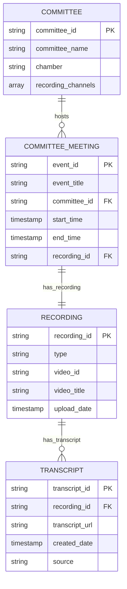

# Committee Meeting Data Platform

A unified data platform for storing and managing congressional committee meeting information, including hearings, markups, recordings, and transcripts.

## Overview

This package provides standardized data models for congressional committee activities, serving as a single source of truth for multiple civic tech projects. The platform addresses the fragmentation of committee meeting data across various sources and provides consistent, accessible data structures.

### [Original Design Doc](https://civictechdc.slack.com/docs/T02GC3VEL/F09N31638MQ)

## Data Models

## Core Models

### Committee
Represents congressional committees across House and Senate.

**Fields:**
- `committee_id` (Primary Key): Committee ID from Congress.gov API
- `committee_name`: Official committee name
- `chamber`: "House" or "Senate"
- `recording_channels`: Array of platform channels (originally `youtube-accounts.csv`)

### Committee Meeting
Central entity for individual hearings and markup sessions.

**Fields:**
- `event_id` (Primary Key): Event ID from Congress.gov API
- `event_title`: Meeting title/subject
- `committee_id` (Foreign Key): Links to hosting committee
- `start_time`, `end_time`: Meeting schedule
- `recording_id` (Foreign Key): Associated recording

### Recording
Platform-agnostic video recording metadata.

**Fields:**
- `recording_id` (Primary Key): Internal recording identifier
- `type`: Platform type ("youtube", "alkami")
- `video_id`: Platform-specific video identifier
- `video_title`: Video title
- `upload_date`: Upload timestamp

**Note:** Video URLs are constructed from `type` + `video_id` (`https://youtu.be/<video_id>`).

### Transcript
Transcript data from various sources (automated, official, corrected).

**Fields:**
- `transcript_id` (Primary Key): Unique transcript identifier
- `recording_id` (Foreign Key): Links to source recording
- `transcript_url`: URL/path to transcript content
- `created_date`: Creation timestamp
- `source`: Origin ("Congress.gov API", "YouTube Auto-Generated", etc.)

## Relationships

- **Committee → Committee Meeting**: One-to-Many (committees host multiple meetings)
- **Committee Meeting → Recording**: One-to-One (each meeting has exactly one recording)
- **Recording → Transcript**: One-to-Many (multiple transcript versions per recording)