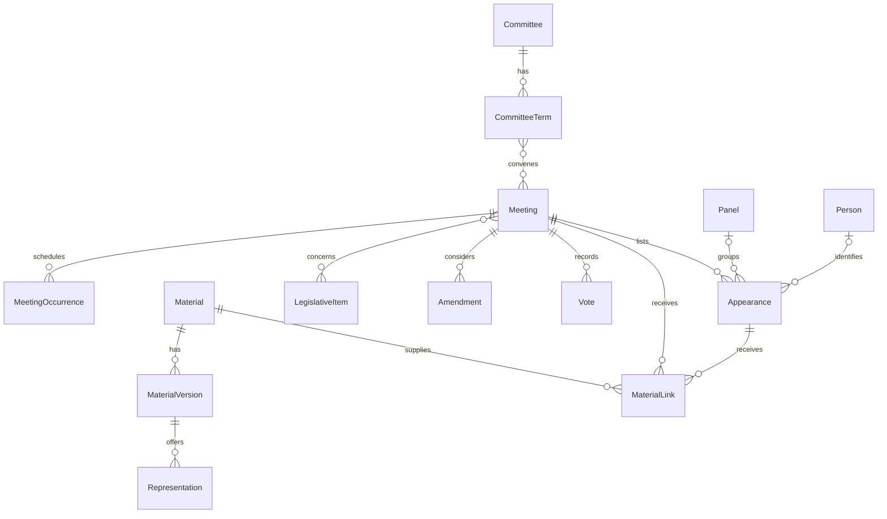

# Committee Explorer data model

**Status: executable model, schema `0.1.0-draft.2`.** These models validate
records and relationships. The application exporter and its IdRegistry are
current policy ([adapter identity policy](../../../../docs/congress-api-contracts.md#adapter-identity-policy)); this package still does not replace transcript bodies.

## Recommendation

Make **meetings, appearances and materials** the main records. Give each a
stable identity and evidence for its facts and relationships. Separate a meeting
from its dated sittings, a witness appearance from a resolved person, and a
material from its revisions and file formats.

This supports all six proposed Explorer views: Meetings, Committees,
Recordings & documents, Witnesses, Coverage, and Gaps & issues. A researcher can find a hearing,
follow its participants and amendments, and open every supported recording or
text source. A print or video with no matched meeting remains discoverable.

The model supplies a shared vocabulary between existing source packages and an
app-owned exporter. It requires no new database, service or matching engine.

| What goes in? | What happens? | What comes out? | How do we check it? |
|---|---|---|---|
| Pinned native meeting records, House/Senate results, GPO metadata, video/caption observations and existing transcript bodies | Adapters preserve evidence; the exporter assembles records and supported links | Validated metadata, source details, manifest and partitioned site/download files | Record and relationship validation, source reconciliation, then public artifact readback |

## Core relationships



The last two relationships show common `MaterialLink` targets. Links can also
target occurrences, committee terms, legislation, amendments, amendment groups
or votes. Each link has one typed target; separate links express separate
relationships. A document's existence does not establish its associations.

### Committees, meetings and participants

| Record | Purpose and important fields |
|---|---|
| `Committee` | Continuing identity, display label and exact provider IDs. A reused code or name alone does not prove continuity. |
| `CommitteeTerm` | Committee in a Congress: name, chamber, type, parent term, active dates, jurisdiction and website. Congress-scoped codes belong here. |
| `CommitteeRelation` | Evidence-supported rename, replacement, split or merger; preserves predecessor and successor identities. |
| `Channel` / `CommitteeChannel` | Provider-neutral channel and its committee association, including active dates and official/majority/minority/member/archive role. |
| `CommitteeMembership` | Optional person/committee association with active dates, role, party, state and district; populate only from supporting inputs. |
| `Meeting` | Proceeding identity, title, Congress/session, chamber, type and all convening committees with their roles/evidence. No required video or invented title. |
| `MeetingOccurrence` | One sitting/day: scheduled and actual start/end, status, access and location. A multi-day proceeding can have several occurrences. |
| `MeetingRelation` | Separate entries describing the same proceeding, a continuation or a rescheduled replacement. Does not automatically merge records. |
| `Panel` | Meeting-scoped grouping with optional occurrence, label and display order. |
| `Appearance` | Recorded name, roles, participation, affiliation, panel, occurrence and optional resolved person. |
| `Person` / `Organization` | Optional supported identities. Names alone do not justify cross-meeting person joins. |
| `RecordedName` / `Affiliation` | Name components, honorific/suffix/retired text, position, organization, location and whom the person represents, as recorded for that appearance. |

A full committee and subcommittee can both convene a meeting. Parent committee
references are scoped to the same Congress. A term represents one committee in
one Congress; selected metadata and its source observations may change during
that term. This draft does not build a complete historical membership directory.

A rescheduled notice changes the scheduled time of the same occurrence unless
evidence identifies a distinct sitting. Keep earlier observations; do not count
both dates as hearings held. `scheduled`, `rescheduled`, `postponed`, `canceled`,
`held`, `not_held` and `unknown` remain distinct. Access is separately `open`,
`closed`, `partly_closed` or `unknown`. A past source record still labelled
Scheduled is not proof that the hearing occurred.

Two appearances named Alex Smith remain separate without identity evidence.
Their affiliation belongs to each appearance, so a later employer cannot
rewrite earlier hearings. A listed witness or nominee is not automatically
someone who testified. A witness document links to an appearance only when
ownership is supported. Never copy a shared print's entire witness list into
every linked meeting.

### Materials, versions and formats

| Record/value | Purpose and important fields |
|---|---|
| `Material` | A described document, recording or text product. Title, Congress, chamber and proceeding dates support discovery before meeting matching. |
| `DocumentDetails` | Transcript, statement, biography, disclosure, witness list, questions/responses for the record, amendment, vote, report, bill text, errata and other categories. |
| `RecordingDetails` | Audio/video, full/clip/compilation, provider and optional channel. |
| `TextDetails` | Transcript, captions, translation, summary or other text; publisher/human/automatic/mixed production. |
| `MaterialVersion` | Edition/revision, publication/modification/generation dates, language tags, duration/page count and optional superseded version. |
| `Representation` | File/encoding: exact locations, media type, format label, encoding, optional size/digest/retained bytes, inspected XML root and content schema. |
| `MaterialLink` | Material's role and full/partial/unknown coverage of a typed subject, optionally pinned to a version and a portion of an exact representation. |
| `MaterialRelation` | Directed relationship between versions: transcribes, derived from, translation of, corrects, part of or alternate of. |
| `SpeakerAttribution` | Optional bridge from a transcript representation's local speaker key to an appearance. |

Apply these distinctions consistently:

- **PDF, HTML and XML of one edition:** one material, one version, several
  representations. Their bytes differ; they are not duplicate files.
- **Publisher revises a statement at the same URL:** add a version and retain
  earlier evidence/files where available. An unchanged crawl is not a new edition.
- **Separate errata:** a distinct material/version with a `corrects` relation.
  A corrected edition of the original work can instead supersede its old version.
- **Official printed transcript:** a document with category `transcript`, valid
  without a recording. Parsed JSON can be another representation of that edition.
  Reference the existing transcript body schema in `content_schema`.
- **Generated transcription, translation or summary:** a separate text material
  related to its input version, with a versioned derivation method in its evidence.
- **Caption track:** a text material once a particular track is identified.
  Estimated availability alone creates an assessment, not a fictional track.
- **Shared volume or compilation:** one material linked to several meetings.
  Page/time ranges identify the exact representation; PDF and HTML pagination
  are not interchangeable. Times start at that file's recording start.
- **Several listings of a file:** cite all relevant listings; share a
  representation only with identity evidence. Equal digests establish byte
  equality, not identical purpose or participant ownership.

Locations distinguish landing pages, players, downloads, streams and APIs.
A player URL remains useful without a downloadable media URL. Materials and
versions may have no known representations; representations may have no
currently accessible location. Do not fabricate URLs.

`xml_root` records an inspected local name and namespace. `amendment-doc`
describes file structure; it does not establish legislative identity or prove
another PDF has an XML counterpart. There is no permanent preferred text source:
all sources remain available, while a versioned display rule can recommend one.

### Legislative context and actions

| Record | Purpose and important fields |
|---|---|
| `LegislativeItem` | Bill, resolution, nomination, treaty or other reference; Congress, exact designation, title and provider IDs. |
| `MeetingSubject` | Evidence-supported considered/mentioned/related meeting association. |
| `Amendment` | Meeting-scoped local number, target item or amendment, sponsors, type, description and disposition. |
| `AmendmentGroup` | En-bloc label and known members, scoped to a meeting. Unknown membership stays empty. |
| `Vote` | Meeting-scoped committee action: subject, local number, question, method, outcome, time and optional tally/ballots. |

Amendments and votes can exist without attachment URLs. Attachments become
linked materials. A `Vote001.pdf` filename does not establish a roll call,
result or tally. Missing counts remain `null`; missing ballots do not mean zero
votes. Ballots may preserve a name without a resolved person, and a recorded
ballot list is not assumed complete.

An incomplete designation such as `H.R.` stays in source evidence rather than
becoming a fabricated globally identified bill. Local amendment numbers are
not Congress-wide identifiers and may repeat for different bills/document groups.

## Identity, time and evidence

Every domain record has `id`, `identifiers`, `provenance` and optional
`field_evidence`. References use `{ "kind": "meeting", "id": "…" }`.
The key is **(kind, id)**; typed references limit allowed target kinds.

Allocate IDs once and persist them in the owning adapter/exporter. Use a
namespaced provider key with all required scope where possible, or a persisted
opaque ID. Never derive durable IDs from titles, normalized names, mutable URLs,
the preferred source, or list positions across snapshots. Rows without source
IDs need a retained input selector and a persisted association to the allocated
ID. Establishing correspondence across future snapshots is adapter work.

`Identifier` contains `scheme`, exact `value`, and optional `scope`; scope is
part of the key. Examples: Congress.gov event IDs with Congress/chamber context,
committee codes by Congress, GPO package IDs, YouTube IDs and Bioguide IDs.
Keep original and normalized committee codes separately identified.

Keep distinct provider meeting entries until evidence supports unification.
`same_proceeding` does not silently choose a survivor or move appearances.
A later merge needs a persisted old-to-new mapping and working public links.
This proposal includes no automatic merge or global name-based person resolver.

| Clock | Meaning |
|---|---|
| Occurrence scheduled/actual times | Planned versus reported occurrence time. |
| Version published/modified/generated times | Publisher release/change or generation of that edition. |
| Source `retrieved_at` / `imported_at` | Established retrieval time versus entry into this export. Import is not a live check. |
| Assessment `observed_at` / `evaluated_at` | Actual check time versus time the conclusion was computed. |
| Manifest `generated_at` | Export generation time. |

`ReportedTime` preserves date-only values, local times without known zones,
precision, approximations and original spelling. It never substitutes midnight
UTC for an unknown time. Check dates can also retain `ReportedTime` precision;
an imported day-only receipt must not become an exact timestamp. Retrieval/import/
export operation timestamps require timezone-aware datetimes. GPO `date_ingested` is neither the hearing date nor
proof of original publication; retain it as provider metadata.

Absent scalar facts are `null`; empty relationship lists mean none recorded in
this export. Neither proves absence. Native evidence preserves the distinction
between missing, explicit empty and null source fields.

### Evidence without wrapping every field

`SourceRecord` retains a source observation: provider key, source URL, native
public payload or digest-pinned retained artifact, dates and optional manifest
input ID. It identifies retained evidence rather than whatever a mutable URL
serves today. Identical content may share stored bytes while observations retain
different retrieval times.

`Citation` points to a source record with an optional JSON Pointer, XPath,
row key, page, time or text selector. `Provenance` distinguishes reported,
observed, derived, inferred and curated facts. Derived/inferred facts require
a named, versioned method. A classification or match should cite its inputs.

Ordinary facts use record provenance. `FieldEvidence` can override it at a
specific JSON Pointer and retain alternative values, their evidence and a
selection explanation. The selected title still lives at `Meeting.title`.
Clients need not traverse a universal claims model for ordinary display fields.

Preserve all public provider fields in source details even when not normalized.
Promote fields into the typed model when shared queries or user actions need
them; do not scatter generic `extras` dictionaries across domain records.
The exporter documents publication omissions and exposes public source links;
local cache paths are not public downloads. Retaining today's inputs cannot
reconstruct discarded historic payloads, removed elements or file revisions.

## Coverage, issues and publication

`Assessment` names a subject, aspect, status, evidence, provider, scope and
evaluation/observation dates. Aspects include recordings, transcripts, captions,
witnesses, documents, Event IDs, reachability and captured content.

| Status | Meaning |
|---|---|
| `available` | Evidence supports availability in scope. Basis distinguishes reported/observed from inferred. |
| `not_found` | A dated check found nothing in an explicit scope; date and scope are required. |
| `unknown` | No adequate conclusion, including unprobed automatic-caption availability. |
| `not_applicable` | The stated coverage rule does not apply; explain why. |
| `blocked` / `error` | Attempt could not establish availability; not a negative finding. |

An inferred Senate caption finding can be `available`, basis `inferred`, with
no captured text. The UI must show status and basis together. YouTube
`caption=false` alone means `unknown` for automatic captions. An old negative
without a reliable observation date remains unknown; preserve the original
negative in source evidence.

Advertised file, reachable URL, retained bytes, parseable text and searchable
transcript are different facts. Use scoped assessments for checks and
`Representation.retained` only for bytes actually retained. Source availability
does not establish permission to mirror a provider's media.

`DataIssue` is separate from an availability assessment. It identifies an affected
record and optional field, a category (missing, unverified, conflicting,
incorrect, stale, unlinked or duplicate), impact, detection/check dates and an
open/resolved/dismissed state. A missing issue requires a supported expectation;
an inference alone cannot establish an incorrect value. A conflict preserves
both observations without declaring either wrong. Closing an issue requires a
dated explanation and separate supporting provenance; retain the original finding.

The exporter persists issue identity by subject, field and rule across snapshots.
A successful correction or explicit decision closes it; a missing source row or
failed refresh does not. Provider-wide gaps belong in input limitations/coverage
rather than one issue per null field. An empty issue list never certifies
completeness. The UI must show unknown/unchecked populations alongside known
issues, and issue counts cannot become a generic confidence percentage.

`CoverageMetric` declares its counting unit, eligible population, versioned
method, input IDs, numerator, denominator, evidence basis and optional unknown
count. Unknown is disjoint from the numerator and within the denominator.
For denominator zero, display no percentage. Meetings, occurrences, appearances,
materials and files are different counting units; summing source rows is not
deduplication.

`Catalog` is the complete validation set, with source observations and a
discriminated list of typed records. **It is not the browser payload.** Validate
relationships before partitioning into small indexes, details and downloads.
A detail file may contain outgoing references; validate it as records, not as
a complete catalog with everything else missing.

`PublicationManifest` identifies the export, generator, pinned input artifacts,
source coverage/freshness, latest attempt outcomes, limitations, previous
publication and partition paths/digests/counts. Failed refreshes may use explicit
last-successful inputs. Publication time cannot make those sources look fresh.

`PublicationManifest.source_scopes` describes intended source families, including
partial, not-collected, unsupported and failed scopes. An uncollected family
needs no fictitious input artifact. Included/partial scopes reference actual
manifest inputs. An empty scope list means scope was not described, not that
everything was collected. Unknown population size does not become zero coverage.

The exporter must additionally check that source/metric input IDs exist in the
manifest, digests match actual bytes, selectors resolve in retained inputs, and
indexes agree with details. These checks require artifacts; validating metadata
alone cannot perform them. Keep generated datasets/state outside the code
branch's history. Publish after data jobs settle, retaining the working site
when export validation fails.

## Mapping existing inputs

These are proposed adapter rules, based on implementation merged in `3108a6d`
and the retained inputs reviewed for the Explorer design. No importer is added.

| Input | Mapping | Preservation rule / gap |
|---|---|---|
| Native Congress.gov meetings | Meetings, occurrences, committees, appearances, materials, meeting subjects, source observations | Read full records, including statuses excluded by the inventory. Walk lists within `relatedItems`; dictionary length is not a bill count. |
| Native witnesses/witness documents | Appearances and supported material links | Preserve native lists; document ownership may remain unresolved. |
| `meeting_witnesses.csv` | Recovered appearances with method/source evidence | This is not the complete witness population. Reconcile native/recovered overlap. |
| `house_witnesses_found.csv` | Name components, affiliation, panel, participation, optional Person from Bioguide ID | `NA` display order stays unknown; preserve raw witness type/testified flags. |
| House meeting/witness XML | Source observation, document materials/versions/formats, participant ownership, amendments/votes | Each document element may have several URLs. Current flattened document output retains only one full URL; expand owner output before exporting all formats. |
| House/Senate document tables | Materials and evidenced meeting links | Basenames, titles and guessed suffixes do not prove file identity. |
| `house_amendments_found.csv` | Amendments, groups, votes, sponsors and document representations | Rows repeat per format; group by evidenced source document, not local number alone. Missing bill IDs/results stay unresolved. |
| Senate page results | Source observations, links, appearances, materials | Retain page/Congress.gov IDs and source matching evidence. |
| `gpo_hearings.csv` | Transcript/errata materials, versions, package IDs, formats, proceeding dates and supported links | Retain original/normalized codes, serial, ingestion and modification metadata. Shared prints do not assign all witnesses to every meeting. |
| GPO/video and curated recording matches | Recording materials and versioned material links/relations | Preserve match method and inputs; date coincidence is not identity. |
| YouTube caches/channel table | Channels, committee-channel links, recordings and source observations | Other provider metadata remains in source details; member/archive roles stay distinct. |
| Caption indexes/rules | Dated assessments; identified tracks become text materials | Inferred availability is distinct from captured text. |
| Existing transcript JSON | Representation whose `content_schema` identifies `congress_api.transcribe.Transcript`, version `1.0` | Reuse header, local participants, turns and inserts. Optional `SpeakerAttribution` bridges to appearances. Body validation remains with its owner. |
| Completeness/coverage tables | Reconciliation inputs and versioned coverage outputs | Counts cannot reconstruct discarded witness/document/location fields. Preferred-source reports remain derived views. |

Some imports lack reliable observation dates, matching outputs lack enough
detail to replay a match, and flattened House documents lose alternate full
URLs. Retaining an output as evidence records what we received; it does not
recover missing upstream evidence. Expand the source-owned output where required.

## Package boundaries and evolution

| Module | Responsibility |
|---|---|
| `common.py` | Identifiers, typed references, time, location and exact-file portions. |
| `provenance.py` | Observations, citations, methods, field alternatives and shared record fields. |
| `committees.py`, `meetings.py` | Committees, proceedings, occurrences and participants. |
| `materials.py`, `legislation.py` | Resource versions/formats and legislative context/actions. |
| `assessments.py`, `issues.py`, `publication.py` | Checks, evidence-backed limitations/corrections and reproducible export metadata. |
| `catalog.py` | Typed record union and relationship validation. |

Dependencies run source adapters/exporter → `committee_meeting` → Pydantic and
standard library. This package imports no scraper, app, database or frontend.
Pydantic provides validation, serialization and generated
[JSON Schema](https://docs.pydantic.dev/latest/concepts/json_schema/) from the
same declarations. Custom Python validators additionally enforce relationships;
JSON Schema alone does not prove cross-record integrity.

| Boundary | Owner | Status |
|---|---|---|
| Acquisition, parsing, refresh, matching | Existing source packages/helpers | Preserve current ownership. |
| Shared metadata definitions | `committee_meeting` | Introduced by this draft. |
| Identity persistence, joining, coverage, partitions | Application exporter | Current. The exporter persists IDs in its IdRegistry ([adapter identity policy](../../../../docs/congress-api-contracts.md#adapter-identity-policy)). |
| Transcript content and parsing | Existing transcript schema/parser | Reused by reference. |
| Search, filters, display preferences | `apps/site` | Consumes exports; does not infer identities or source freshness. |

The app can flatten index rows for filtering, derived from these records.
No SQL schema, object-relational mapper, generic property graph, search service
or append-only event system is needed. Measure before introducing any of them.

Every export declares a schema version. Preserve old artifacts through explicit
supported-version readers/migrations; never reuse an ID for another entity.
Domain records reject unknown fields, so even additive fields/enum values need
an explicit reader/version rollout. Source payloads remain open to unmapped
provider fields. Generate JSON Schema and eventual consumer types from these
definitions; do not maintain a second handwritten domain schema.

## Validation and adoption

From the repository root with Python 3.12+ and the package dependency installed:

```sh
PYTHONPATH=packages/committee_meeting/src .venv/bin/python -m unittest discover -s packages/committee_meeting/tests -v
PYTHONPATH=packages/committee_meeting/src .venv/bin/python -m committee_meeting.main > /tmp/committee-meeting.schema.json
PYTHONPATH=packages/committee_meeting/src .venv/bin/python packages/committee_meeting/examples/worked_catalog.py > /tmp/committee-meeting.example.json
```

The worked example is explicitly synthetic: a two-day joint hearing, same-name
unresolved appearances, a corrected multi-format print shared with another
proceeding, an unlinked recording, inferred captions, amendments, an en-bloc
group and a vote without a tally.

`tests/house-formats.xml` comes from the retained fixture
`tests/fixtures/meeting_inventory/house-formats.xml` at `3108a6d`. Its three
documents and six exact PDF/XML URLs provide a real-shape mapping check.
Tests neither fetch those URLs nor establish that they still work.

The suite checks serialization, missing/wrong references, duplicate IDs,
cross-meeting/Congress links, revision/parent/amendment cycles, file ownership,
digest consistency, field evidence, uncertainty and publication counts.
Revalidate the complete catalog after edits. Frozen fields discourage accidental
reassignment, but raw payload dictionaries are not deeply immutable and bypass
APIs such as `model_construct` are not validation.

Adopt in five steps:

1. Agree on vocabulary and identity rules; reserve a stable schema version.
2. Build a bounded app exporter from retained inputs. Persist IDs/selectors;
   include missing-link and excluded-status cases. Expand source-owned outputs
   where the mapping requires it.
3. Reconcile input populations and associations, explaining deduplication and
   omissions. Matching only totals is insufficient.
4. Validate the whole export, partition it, and measure full-corpus memory,
   build time and browser transfer size. Exercise the user tasks below.
5. Connect the site/workflow and verify public bytes against the manifest.

## Architecture assessment

### Findings and lineage

| Finding | Evidence | Decision |
|---|---|---|
| Four initial entities cannot represent current relationships. | Package initialization `8de9e1a`, README relationships: one committee and exactly one recording per meeting; transcript requires recording. | **RESHAPE** with occurrences, independent materials, appearances and explicit links. |
| Summary tables omit native detail. | `inventory/completeness.py:53–70`, `:79–82`. | **KEEP** native observations plus recovered inputs. |
| Document identity differs from file format. | `house/repository.py:116–136` groups files and emits amendment rows per URL. | **INTRODUCE** material/version/representation and independent amendment identity. |
| A second transcript body duplicates existing work. | `transcribe/schema.py:26–98`. | **KEEP** that body schema; reference it. |
| Caption availability does not prove captured text. | `inventory/captions.py:3–17`, `:63–72`. | **INTRODUCE** scoped assessments with status, basis and dates. |
| Exporter/site integration is still proposed. | Explorer design, “Data ownership and publication”; `apps/site/src/components/dashboard/Dashboard.tsx:48` consumes aggregates. | **DEFER** deployment claims until exporter and consumer verification exist. |

Code references above are relative to
`packages/congress_api/src/congress_api/` at `3108a6d` unless a full repository
path is given.

| Prior artifact | Relationship |
|---|---|
| [Committee Explorer integrated design](../../../../docs/youtube-coverage/committee-explorer-design.md), “Model-to-interface mapping” and “Data ownership and publication” | Parent: six views, conservative joins, visible known unknowns, static export and source freshness. This model supplies its records. |
| `apps/site/src/content/proposals/I.1.md:17–31` | Earlier unified hearing/markup product intent; this supplies its metadata foundation. |
| `apps/site/DESIGN.md:26`; `apps/committee_youtube/README.md:24–34` at `3108a6d` | Static site, isolated reader failures, state on `pipeline-data`. |
| `congress_api.transcribe.schema` | Sibling owns transcript content; this model owns surrounding metadata/links. |
| Original README's private Slack design link | Not accessed; no claim of conformity. This proposal is self-contained. |

### Commitments

| Commitment | Status | Check / failure addressed |
|---|---|---|
| Source packages own acquisition/matching | Preserved from parent design and `inventory/main.py` | No source-package imports/network calls here; avoids conflicting match rules. |
| Selected facts/links have evidence | Newly explicit | Citations/methods required; exporter must replay selectors. Prevents guesses becoming facts. |
| Same-name appearances are not automatically one person | Preserved | Unresolved identities remain valid; prevents false histories. |
| Shared materials do not duplicate participants or file counts | Preserved | Typed links plus source reconciliation; never sum overlapping tables. |
| Import/build time does not prove freshness | Preserved | Separate clocks and manifest limitations. |
| Static site; generated state outside `main` | Preserved | Partition export artifacts, keep only definitions/small examples in code. |
| Export failure preserves upstream output and working site | Preserved adoption requirement | Must be verified with future exporter/workflow integration tests. |

### Value, counterfactuals and verdict

This is **product data infrastructure**, not a shipped feature. Its value is
realized when users can find a committee's hearings with readable text, trace
an organization's witness appearances, and locate markup amendments/votes
without manually joining tables.

Four expanded classes would initially be smaller but mix formats with revisions
and require special cases for shared prints and unresolved people. A universal
entity/edge/property system would make every client reconstruct domain meaning.
Typed domain records with one reference type preserve useful distinctions
without building a generic graph platform.

**Kill criterion:** if a bounded exporter needs invented joins or forces routine
queries back into raw payloads, reshape the affected fields before adoption.
If users need only links and never navigate participants, actions or versions,
defer those adapters rather than collect new data just to fill the model.

**Removal probe:** removing this draft today changes no production behavior.
After adoption, removing the exporter should affect Explorer publication while
acquisition and transcript production continue. **Sibling overlap** with I.1
is intentional; transcript content is reused. **Six-month risk:** comprehensive
looking records conceal weak provenance, stale inputs or unsafe deduplication.
The documented gaps and reconciliation rules address that risk; types alone
cannot establish truth.

**Verdict: adopt as a draft metadata model; validate a bounded exporter before
making it the public schema.** Structure matches the Explorer design and the
principal distinctions follow current source evidence. Existing ownership and
storage commitments are preserved. Confidence is high in those distinctions,
moderate in untested full-corpus migration and performance. Tests establish
structural cases, not correct entity matching or a deployed Explorer.
