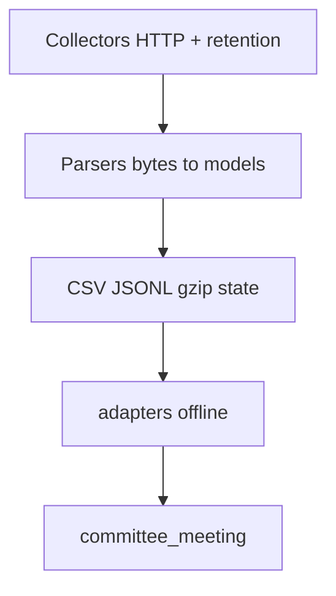

# Refactoring plan — `congress-api`

Status: **proposal only** (no implementation in this document).  
**Audits merged into plan body:** 2026-09-29 (red/green validation swarm + evolutionary-design / Fowler audit; standalone `REFACTORING_PLAN_VALIDATION.md` and `REFACTORING_PLAN_FOWLER_AUDIT.md` were deleted and **were not committed to git**).  
**Review pass applied:** 2026-09-29 (HEAD validation of claims; Phase 3 helper, §7 CI sketch, Phase 6a caller list, and package README HTTP sentence reshaped below).  
Scope: `/Users/mikewolfd/Work/congressional-tech/packages/congress_api/` (~99 files under package root + `src/congress_api/`).

This plan assumes the architecture in [SOURCE_MODELS.md](SOURCE_MODELS.md) and [README.md](README.md): publisher bytes → source parsers → Pydantic source models → offline `adapters/` → `committee_meeting` → export/storage. Collectors fetch and retain; parsers do not open output files; adapters do not re-fetch. Sibling constraints: [SOURCE_MODEL_REVIEW.md](SOURCE_MODEL_REVIEW.md) (source-contract tests), [FILENAME_PATTERNS.md](FILENAME_PATTERNS.md) (Phase 5), [Meeting state](../../docs/youtube-coverage/meeting-state.md) (gzip inventory paths / `--offline`).

---

## 1. Executive summary

`congress-api` is a **multi-pipeline data package**: it mirrors Congress.gov meetings (`meetings.py` → `http.get_with_retry`), retains committee snapshots (`committee_metadata.py`), builds a GovInfo CHRG cache (`gpo/fetch.py`), crawls chamber sites (`house/records.py`, `senate/records.py`), joins weekly inventory (`inventory/main.py`), matches video (`gpo/match.py`), and produces transcripts (`transcribe/main.py`). A **legacy TinyDB explore path** (`fetch/`, `analyze/`, `congress-fetch` / `congress-analyze`) is **not** on the weekly CI pipeline; production uses **`congress-meetings`** plus YouTube TinyDB. **Explorer normalization** lives in `adapters/` (`apps/committee_youtube` / `committee_explorer.export`).

Pain points are **boundary and contract drift**, not missing features:

- **HTTP landscape (not “four stacks to merge”):** production collectors and **`meetings.get`** (thin wrapper over **`http.get_with_retry`**, default **`attempts=5`** vs http **`3`**) are **not** a second client. Package **README.md L225** still says “own retrying HTTP client” — **known-wrong; correct in Phase 0/1**, do not copy into the compatibility appendix. The real **fork** is bare **`requests`** in **`api.py`** (TinyDB legacy fetchers). **Special cases** stay documented separately: **`senate/captions.py`** module-level **`sess`** (`requests.Session`, `pool_maxsize=32`; there is no `CaptionsSession` type), **`transcribe/`** raw `requests`, **`transcribe/metadata.py`** `urllib` — characterize and test; Phase 1 is policy matrix + import fix + fork tests + README correction, **not** splitting **`http.py`** into an `http/` package.
- **Replay:** three offline upgrade drivers with **different** receipts and protection rules — **documented protection matrix + optional tiny helpers only** (audits rejected a unified replay engine, single receipt schema, or cross-chamber protected-fields registry).
- **CLI:** 12 console scripts; **`congress-committees`** alone uses `committee_metadata:main` — Phase 3 is **entrypoint rename only** (no shared `source_args` helper); placeholder root **`main.py`**.
- **Inventory:** orchestration + **late acquisition** (`get_witnesses`, Senate probes); **`--offline`** semantics differ by command.
- **Imports:** `gpo/transcripts.py` pulls `get_with_retry` via accidental **`gpo.fetch`** re-export.
- **Identity (not digest-only):** Explorer-safe adapter work depends on **layered** identity — **`common.digest`**, semantic keys → **`IdRegistry`**, **`known_materials`**, transcript byte SHA — not **`common.digest` alone**.
- **DI (Parameterize Method, not a container):** `AdapterContext` and `meetings.get(session, …, api_key)` already inject collaborators. House/Senate/inventory HTTP still uses **`http.get_with_retry(None, url)`**. The only planned extra seam is a defaulted **`get=`** on inventory **acquisition** (Phase 4) — not an `HttpClient` protocol, not a new package.

Refactors must **preserve pipeline-data contracts** (gzip determinism, GPO CSV cache, console script names, layered adapter identity). Physical package moves are **last**, not first.

---

## 2. Goals and non-goals

### Goals

1. **Publish interfaces before motion** — Phase 0 compatibility appendix, CI grep, identity/digest policy.
2. **Clarify layers** — collectors vs parsers vs adapters vs inventory orchestration (SOURCE_MODELS).
3. **Thin, test-backed increments** — HTTP matrix + import hygiene; replay helpers; `congress-committees` entrypoint rename; inventory acquisition split with defaulted **`get=`**.
4. **Keep external contracts stable** — script names, `source_args` flags, artifact columns/paths unless versioned.
5. **Parser upgrades** — inventory of `PARSER_VERSION` / `SCHEMA_VERSION` / `CAPTURE_VERSION` constants and migration checklist.

### Non-goals (defer)

- Replacing CSV/JSONL/gzip with a single database.
- Merging **`congress-meetings`** with **`congress-fetch`** (second meeting authority).
- **Merging HTTP stacks** in early phases (characterize **`api.py` vs `http`** with tests first).
- Unified **replay engine** or single receipt JSON schema.
- Unified **`congress-api` mega-CLI** (Phase 8) unless operators explicitly request it.
- Physical **`collectors/` / `parsers/`** tree (Phase 7) until Phases 0–4 stable and monorepo grep gate exists.
- **DI container**, HTTP **`Protocol` / `HttpClient`**, or forcing **`api.py`**, captions **`sess`**, **`transcribe/` `urllib`**, and **`http.py`** onto one interface.
- New packages for HTTP, adapters, filenames, transcribe, or TinyDB (current package arrows are the injection boundary; see [§2.1](#21-parameterize-method-not-a-container)).
- Generic House/Senate HTML scraper; stable `congress_api.__all__` without versioning policy.

### 2.1 Parameterize Method (not a container)

Fowler-light DI here means **passing a collaborator with a production default**, not a registry.

**Keep (already parameterized):** `AdapterContext` (`now`, `ids`, `known_materials`); CLI-edge `load_congress_api_key()`; `as_of` / `today` / `offline` / `seed_cache`; `meetings.get(session, url, api_key)` and `committee_metadata.collect(..., session=, api_key=)`.

**Add in Phase 4 only:** inventory acquisition takes `get=http.get_with_retry` (CLI `main()` does not grow a `get` flag). Tests pass a stub; production omits it. Keep **`session=None`** as the thread-local gateway default inside `http.get_with_retry`. Do **not** thread `session` through every house/senate records function in Phase 1. Do **not** inject `zyte.token` / `load_congress_api_key` (one env/file each at process edge).

**Package arrows (do not reshuffle in Phases 0–6):**

| Package | Role | Do not move into it |
| --- | --- | --- |
| `congress_shared` | auth, paths, bundled CSV (no Python deps) | `http.py` / Zyte / House pacing (`requests` would leak to every consumer) |
| `committee_meeting` | canonical models | adapters (must not know Congress.gov / House / GPO) |
| `congress_api` | collectors + parsers + `adapters/` | — this is the source package |
| `committee_explorer` | `IdRegistry`, export | adapters (Explorer **passes** `ids` into `AdapterContext`) |

`committee_meeting` imports in `congress_api` already live only under **`adapters/`**. Cheap substitute for an adapters package: grep gate “only `adapters/` imports `committee_meeting`.” Extracting `congress_adapters` is Phase 7 YAGNI unless a product must install collectors without `committee-meeting`.

---

## 3. Inventory of issues

*(2026-09-29 red/green + Fowler audit conclusions are woven into this section and Phases 0–6; deleted standalone audit files were not committed to git.)*

### 3.1 Module boundaries

| Issue | Evidence | Risk |
| --- | --- | --- |
| **`api.py` vs `http`** | TinyDB fetchers vs production mirror/collectors | Behavior drift if “merged” without tests |
| **`meetings.get` “second stack”** | Thin wrapper over **`http.get_with_retry`** (`attempts=5`); README L225 still disagrees | Wasted Phase 1 motion if treated as separate client; Phase 0 must not copy README |
| **Layered adapter identity** | Digest + semantic keys + **`IdRegistry`** / **`known_materials`** + transcript byte SHA | Large **`adapters/common`** refactors without Phase 0 policy |
| Inventory acquisition | `witness_lists.get_witnesses`, `captions.probe_day`; **`completeness.build`** on that path | `--offline` breaks if moved blindly; semantics differ by command |
| Parsers + HTTP co-located | `witness_lists.parse_*` beside `get_witnesses` | SOURCE_MODELS tension; split with shims |
| Adapters lazy imports | `gpo.match`, `senate.isvp` in `adapters/meetings.py` | Circularity if collectors co-locate |

### 3.2 Duplication

| Pattern | Locations | Refactor stance |
| --- | --- | --- |
| Replay invariants | `house/replay`, `senate/replay`, `gpo/replay` (different receipts/skip rules) | Document **protection matrix** (Phase 0); optional tiny helpers (Phase 2) — **no** unified engine or shared receipt schema |
| State I/O | `inventory/common.py` | Contract: gzip `mtime=0` |
| GPO merge | `gpo/fetch.merge_cached_row`, `gpo/replay` | Keep coupled |
| Witness line grammar | `witnesses.py`, `witness_lists`, `house/repository` | **Extract Function** in Phase 4 optional |
| Match scoring | `gpo/match`, `inventory/prints`, `text_sources` | Phase 4b optional |

### 3.3 CLI

12 `[project.scripts]`; **`congress-committees` → `:main`**; module replays **`python -m congress_api.{house,senate,gpo}.replay`** (keep paths). Several script modules also runnable as `-m`; house/senate/inventory readers are **console-only** (no `__main__`). See Phase 0 inventory.

Three CLI families — **do not compose them**:

| Family | Helper | Scripts |
| --- | --- | --- |
| Inventory readers | `inventory.common.source_args` (`--meetings`, `--state-dir`, `--output-dir`, `--offline`, …) | `house-meeting-records`, `senate-meeting-records`, `meeting-inventory` |
| TinyDB explore | `congress_shared.globals.add_global_args` (`--tinydb_dir` only) | `congress-fetch`, `congress-analyze`, `gpo-match` |
| Custom + `load_congress_api_key` | own argparse; API key via `parse_known_args` | `congress-meetings`, `congress-committees`, `gpo-fetch`, … |

Phase 3 is **entrypoint rename only** (`congress-committees` → `:parse_args_and_run`). Do **not** invent a shared helper that mixes `source_args` / `add_global_args` into `congress-committees`.

### 3.4 Tests and imports

Tests at repo **`tests/`**. Named coverage exists for HTTP/Zyte, committee metadata, inventory/witness fidelity, house/senate/GPO source fidelity, filename families, Explorer identity reuse. **Gaps:** `retain_rejected_page` unit tests; end-to-end `inventory.main(..., offline=True)`; **`filename_corpus` + pyarrow** (add `[corpus]` extra). Adapter identity is **layered** — see §6. **`gpo/transcripts`** accidental `gpo.fetch` import confirmed.

### 3.5 Legacy

| Artifact | CI | Stance |
| --- | --- | --- |
| `congress-fetch` / `congress-analyze` | **Not invoked** in `.github/workflows/`; weekly production is **`congress-meetings`** (congress job) plus readers / inventory / **`congress-committees`** — see [§7](#7-validation-strategy) | Dev/explore; quarantine in Phase 6 |
| `fetch/rejected.retain_rejected_page` | Callers: **`meetings.py`**, **`committee_metadata.py` only** (legacy fetchers do **not** import it) | **Extract before** quarantine — moving **whole `fetch/`** to `legacy/` was audit-falsified |
| `json_to_tinydb.py` | Ad hoc | Move to contrib with quarantine |

---

## 4. Proposed target structure (aspirational)

**Do not implement Phase 7 layout until preconditions in §5.** Early phases change imports and docs, not directories.

```text
src/congress_api/
  http.py (+ policy doc; optional future http/ package)
  retention/rejected_pages.py   # Phase 6 prerequisite (from fetch/rejected)
  inventory/                    # Phase 4: main + acquisition + witness_lists parsers
  replay/helpers.py             # Phase 2 optional (NOT a unified engine)
  legacy/                       # Phase 6: TinyDB fetch/analyze only
  … existing modules with shims …
```

Conceptual layering (unchanged):



---

## 5. Phased roadmap

**Phase numbers are stable.** **Execution order** follows validation + Fowler consensus (not numeric sort):

| Exec order | Phase | Title | Scope | Risk |
| ---: | --- | --- | --- | --- |
| **1** | **0** | Contract inventory + policies | S | Low |
| **2** | **3** | CLI entrypoint (`congress-committees`) | S | Low |
| **3** | **1** | HTTP matrix + import hygiene (thin) | S–M | Med |
| **4** | **4** | Inventory acquisition split | M | Med |
| **5** | **2** | Replay protection matrix + helpers (thin) | S–M | Med |
| **6** | **5** | Filename submodule + `corpus` extra | S | Low |
| **7** | **6** | Legacy TinyDB quarantine | M | Med |
| — | **7** | Physical collector/parser moves | L | High — **optional / deferred** |
| — | **8** | Unified CLI | M | Med — **optional / reject unless asked** |

**Dependencies:** Phase 0 blocks large adapter/replay work. Phase 6 requires Phase 3-style entrypoint hygiene + **`retain_rejected_page` extract**. Phase 7 requires Phases 0–4 complete + monorepo import grep baseline. Phase 8 requires explicit operator decision (see [ADR hooks](#9-architecture-decision-records-adrs)).

#### Why this execution order (validation + Fowler)

Phase **numbers** stay stable for cross-references; **execution** is reordered to reduce risk:

| Choice | Rationale |
| --- | --- |
| **0 first** | Contracts, CI truth, digest semver, and replay **protection matrix** must exist before adapter or replay code churn. |
| **3 before 1–2** | **`congress-committees`** is the only script on `:main` instead of `:parse_args_and_run`; renaming that entrypoint is a small, testable win **before** HTTP/replay edits. It does **not** introduce a shared CLI helper — `source_args` / `add_global_args` belong to other script families (§3.3). |
| **1 before 2** | HTTP import hygiene and **`api.py` vs `http`** characterization tests reduce accidental coupling before replay modules gain shared helpers. |
| **4 before 2** | Inventory **`get_witnesses`** / completeness paths are active production pain; splitting acquisition clarifies `--offline` before investing in replay helper extraction. |
| **2 fifth** | Replay work is **documentation + optional tiny helpers** only — no unified engine — so it safely follows contract and inventory stabilization. |
| **5–6 after 0–4** | Filename package collision and TinyDB quarantine are **strangler** moves: peel production dependencies (`retain_rejected_page`) first, then isolate explore-only code. |
| **7–8 deferred** | Physical directory moves and mega-CLI fail YAGNI until Phases 0–4 are done and operators still feel pain. |

---

### Phase 0 — Contract inventory (execute first)

Deliverables (observable — see [§5.1](#51-definition-of-done)):

- **Compatibility appendix** (README section or `docs/congress-api-contracts.md`): 12 frozen console script names; primary artifacts per script (format, default paths); **`source_args`** and global flags used in CI/docs. **Do not copy README.md L225** (`meetings.py` as “own retrying HTTP client”) — correct that sentence here.
- **CI inventory table:** `update-data.yml` **four jobs** (not the congress-job sketch alone) + `publish-explorer.yml` — job → command → `pipeline-data` path. Document: job **`needs` + `!cancelled()`**; step continuation via **`steps.*.outcome`** (no repo `continue-on-error`); **`publish-explorer`** on workflow **`completed`**. Starting map (must be re-checked against the workflow file):

  | Job | `needs` | Commands (order) | Notes |
  | --- | --- | --- | --- |
  | `youtube` | — | `youtube-fetch`, `youtube-analyze` | `youtube-api` package; not congress-api scripts |
  | `congress` | `youtube` | `gpo-fetch` → `congress-meetings` → `gpo-match` | Production mirror; **not** `congress-fetch` |
  | `meetings` | `congress` | `pytest -q` → `house-meeting-records` → `senate-meeting-records` → `meeting-inventory` | Readers + inventory |
  | `committees` | `meetings` | `congress-committees` | Official committee snapshots |

- **Parser/schema registry:** grep `PARSER_VERSION`, `SCHEMA_VERSION`, **`CAPTURE_VERSION`**, evidence schema constants → owner module list. Cite [SOURCE_MODEL_REVIEW.md](SOURCE_MODEL_REVIEW.md) as the source-contract gate.
- **Adapter identity contract** (required before `adapters/common` refactors):
  - **`common.digest`** + payload normalization → `source_record` keys; House fallback keys.
  - **Semantic keys** (`govinfo:{package}`, …) → Explorer **`IdRegistry`** materials.
  - **`known_materials` / `primary_rendition_index`** → cross-adapter reuse (`test_gpo_identity_reuse.py` — reuse, not digest golden).
  - **Transcript byte SHA** (separate from `common.digest`).
  - **Digest semver policy:** what changes are breaking vs safe; which tests gate Explorer-safe adapter edits.
- **Replay protection matrix** (per chamber/GPO): skip gates, fields that must not change, receipt filenames — **documentation only** in Phase 0; code helpers optional in Phase 2.
- **Replay module paths:** document stable **`python -m congress_api.{house,senate,gpo}.replay`**.
- Optional: add **`[project.optional-dependencies] corpus = ["pyarrow"]`** here (Fowler preference) or in Phase 5.

**ADR:** open **`docs/adr/adapter-digest-versioning.md`** (stub) when policy text lands.

---

### Phase 3 — CLI entrypoint (execute second — before heavy code moves)

- Add **`committee_metadata.parse_args_and_run`** that wraps the existing **`main()`** argparse; point **`congress-committees`** at it; keep **`main()`** for library / `if __name__` use. Script **name** unchanged (CI safe).
- **Do not** add `source_args` or `add_global_args` to this script (`--meetings-path` / `--gpo-path` / `--output-path` stay as they are). **Do not** invent a shared CLI helper that composes those three families (§3.3).
- Remove or relocate **`packages/congress_api/main.py`** placeholder.

**Validation:** `tests/test_committee_metadata.py`; `--help` smoke for `congress-committees` (and optionally house/senate/inventory readers — already `:parse_args_and_run`).

---

### Phase 1 — HTTP hygiene (thin; execute third)

**Not in scope for this phase:** splitting `http.py` into `http/` package; merging **`api.py`** into **`http.get_with_retry`** without characterization tests; Parameterize Method on house/senate/inventory records (`get=` waits for Phase 4 acquisition).

- **Authoritative HTTP policy matrix** (one place: README table + `http.py` module docstring): hosts, pacing, retries, Zyte eligibility, `response_metadata`, **`senate/captions.py` `sess`** pooling policy, **`transcribe/`** + **`transcribe/metadata.py`** (`urllib`) exceptions, **`api.py`** “minimal JSON client” fork, **`meetings.get`** (`attempts=5` wrapper).
- **README correction:** replace “own retrying HTTP client (distinct from `api.py`)” (**README.md L225**) with the wrapper characterization. The compatibility appendix must match the corrected sentence.
- **Import fix:** `gpo/transcripts.py` → **`from congress_api.http import get_with_retry`** (remove accidental `gpo.fetch` re-export).
- **Characterize fork:** add/extend tests documenting **`api.request_source`** vs **`http.get_with_retry`** behavior on Congress.gov endpoints (TinyDB path vs production).

**Validation:** `tests/test_http_response_metadata.py`, `tests/test_zyte_capture.py` (repo-root `tests/`).

---

### Phase 4 — Inventory layering (execute fourth)

- **`inventory/acquisition.py`:** `get_witnesses`, Senate **`probe_day`** / day-probe loop — all network I/O for inventory completeness. **Parameterize Method:** `get=http.get_with_retry` (default); CLI does not expose `get`. Keep `session=None` inside the gateway. Tests stub `get` instead of only monkeypatching `http.get_with_retry` on the orchestrator.
- **`inventory/main.py`:** orchestration only (no direct HTTP; no `get` parameter).
- **`completeness.build`:** call acquisition APIs explicitly (splitting `main.py` alone is insufficient).
- **`inventory/witness_lists.py`:** keep **`parse_pdf_observation`**, **`parse_mods_observation`** as SOURCE_MODELS entry points; move HTTP to acquisition with **re-export shims** if modules split.
- **`--offline` matrix** (docstring + appendix): per command (**house-meeting-records**, **senate-meeting-records**, **meeting-inventory**) — required gzip state, what still runs (CSV joins, seed import), what raises.
- Optional: **Extract Function** for GPO witness line grammar shared with `witnesses.py` / `house/repository.py`.
- Optional Phase 4b: trim **`gpo.match`** imports from inventory (scoring helpers).

**Default stance (open question):** witness MODS/PDF fetch stays **inventory acquisition** (meeting-completeness-driven) unless ADR chooses collector ownership.

**Validation:** `test_meeting_inventory.py`, `test_inventory_witness_fidelity.py`, caption tests; add **`inventory.main(..., offline=True)`** fixture test when acquisition split lands.

---

### Phase 2 — Replay helpers (thin; execute fifth)

**Explicit non-goals:** unified replay engine; single receipt JSON schema; shared “protected fields” registry implementing chamber rules.

- Implement **protection matrix** from Phase 0 as module docstrings / linked doc — **chamber-specific rules only** (House **`MATCH_FIELDS`** gate vs Senate live-marker skips vs GPO CSV asserts + **`merge_cached_row`**); no cross-chamber “protected fields” registry in code.
- Optional **`replay/helpers.py`:** UTC timestamps, file SHA-256, status tallying, JSON receipt write — **no** shared upgrade loop.
- Keep chamber logic in **`house/replay.py`**, **`senate/replay.py`**, **`gpo/replay.py`**; preserve **`python -m`** module paths (re-export if files move).

**Validation:** `test_house_source_fidelity.py`, `test_senate_source_fidelity.py`, `test_gpo_source_fidelity.py`; receipt diff per module (not one golden schema).

---

### Phase 5 — Filename submodule (when filename work is active)

- Resolve **module→package collision:** today **`filenames.py`** file vs desired **`filenames/`** package — rename/shim plan required. Cite [FILENAME_PATTERNS.md](FILENAME_PATTERNS.md).
- Move **`filenames.py`**, **`bill_codes.py`**, **`filename_corpus.py`** with one-release re-exports.
- **`[project.optional-dependencies] corpus = ["pyarrow"]`** if not added in Phase 0.

**Validation:** `tests/test_filename_*.py`; optional `@pytest.mark.corpus` + fixture Parquet.

**Priority:** lower than Phases 0–4 unless filename corpus is on critical path (Fowler).

---

### Phase 6 — Legacy quarantine (execute after 3 + rejected extract)

Use a **strangler fig** pattern: production keeps calling stable symbols while explore-only code is peeled off — **defer physical `collectors/` / `parsers/` tree moves** (Phase 7) until the explore path is isolated.

**Prerequisite (Phase 6a):** extract **`fetch/rejected.py`** → e.g. **`retention/rejected_pages.py`**; update the two callers **`meetings.py`** and **`committee_metadata.py`**. Legacy fetchers do **not** import `retain_rejected_page`. **Do not** move whole **`fetch/`** to `legacy/` (would drag production **`retain_rejected_page`** into quarantine).

**Phase 6b:** quarantine **TinyDB explore only** — `fetch/main.py`, `fetch/congress_*_fetcher.py`, **`analyze/`**, **`json_to_tinydb.py`**; setuptools shims keep **`congress-fetch`** / **`congress-analyze`** names. Break **`fetch/main` ↔ `analyze`** import cycle first.

- Align **root README** / **devcontainer** with package README (lead with **`congress-meetings`**; legacy path labeled).
- **No new features** on quarantined code.

**Validation:** CI grep (no weekly dependency on explore scripts); unit tests for **`retain_rejected_page`**; smoke `--help`.

**Out of scope here:** fix **`analyze/main.py` L22** (`isinstance(committee, dict)` vs `committees`) — [separate fix](#10-out-of-scope-separate-work).

**ADR:** **`docs/adr/tinydb-explore-sunset.md`** when deprecation messaging is decided.

---

### Phase 7 — Physical moves (**deferred / optional**)

Preconditions: Phases 0–4 shipped; monorepo grep gate; product pain still justifies churn.

- Move parsers/collectors with **one-release shims**; **`apps/committee_youtube`** is migration gate.
- Prefer **documented conceptual layers** before directory moves (Fowler).
- **Still out of scope unless a new install product appears:** `congress_http` or `congress_adapters` packages ([§2.1](#21-parameterize-method-not-a-container)).

---

### Phase 8 — Unified CLI (**deferred / optional**)

Only if operators want one driver. **Must** keep 12 script names as permanent setuptools aliases. Otherwise **reject** (YAGNI — composable CI jobs).

**ADR:** **`docs/adr/unified-cli.md`** if pursued.

---

### 5.1 Definition of done

Checklist style; evidence in PR, not “files moved.”

**Phase 0**

- [ ] Compatibility appendix lists 12 scripts + frozen artifact table matching CI.
- [ ] CI inventory table lists all **four** `update-data.yml` jobs (youtube, congress, meetings including pytest, committees) plus `publish-explorer.yml`.
- [ ] Package **README.md** no longer calls `meetings.py` an “own retrying HTTP client.”
- [ ] `source_args` / global flags inventory matches workflows + meeting-state docs (without mixing CLI families).
- [ ] Parser/schema version registry complete (`PARSER_VERSION`, `SCHEMA_VERSION`, `CAPTURE_VERSION`).
- [ ] **Adapter digest / identity policy** written; ADR stub linked.
- [ ] Replay **protection matrix** documented (three drivers).

**Phase 3**

- [ ] `congress-committees` → `parse_args_and_run` wrapping existing `main()`; flags unchanged (no `source_args` / `add_global_args`).
- [ ] Root placeholder `main.py` removed/relocated.
- [ ] `congress-committees --help` smoke documented.

**Phase 1**

- [ ] No `get_with_retry` import via `gpo.fetch` in production paths.
- [ ] Single authoritative HTTP policy matrix; README L225 corrected.
- [ ] HTTP/Zyte tests green; any retry change accompanied by test update.
- [ ] **`api.py` vs `http`** fork documented and covered by tests.
- [ ] **`meetings.get`** documented as `http.get_with_retry` wrapper (`attempts=5`); captions pooling named as **`sess`**.

**Phase 4**

- [ ] Orchestrator vs acquisition modules documented; orchestrator does not HTTP.
- [ ] Acquisition functions accept `get=http.get_with_retry`; tests can stub `get` without a client protocol.
- [ ] **`--offline` matrix** published.
- [ ] Inventory + witness fidelity tests green.

**Phase 2**

- [ ] Protection matrix referenced from replay modules.
- [ ] Optional helpers only; chamber receipts **unchanged in shape**.
- [ ] `python -m congress_api.*.replay` paths unchanged.
- [ ] Replay fidelity tests green.

**Phase 5**

- [ ] `filenames.py` vs `filenames/` collision resolved with one-release shims.
- [ ] `[corpus]` extra documented; corpus tests marked or gated if Parquet required.

**Phase 6**

- [ ] **`retain_rejected_page`** lives outside quarantined `fetch/` (callers remain **`meetings.py`** and **`committee_metadata.py`**); **`congress-meetings`** / **`congress-committees`** unchanged at CLI level.
- [ ] Weekly CI still runs **`congress-meetings`** (not **`congress-fetch`**); explore scripts optional/dev-only in docs.
- [ ] **`retain_rejected_page`** unit tests; explore `--help` smoke.

---

## 6. Migration notes

### Console scripts

| Name | Entry today | Through Phase 6 |
| --- | --- | --- |
| 11 scripts | `:parse_args_and_run` | Unchanged names |
| `congress-committees` | `committee_metadata:main` | Phase 3 → `:parse_args_and_run` |
| Replays | `python -m congress_api.*.replay` | Paths stable |

### Data / identity compatibility

- **`inventory.common.write_state`:** no serialization change without state major version.
- **GPO CSV:** `package_id`, **`merge_cached_row`**, **`PARSER_VERSION`** semantics preserved.
- **Adapter identity (layered):** digest → source keys; semantic keys → **`IdRegistry`**; **`known_materials`** → reuse tests; transcript byte SHA separate. Policy lives in Phase 0 appendix.

---

## 7. Validation strategy

| Layer | Tests |
| --- | --- |
| Source / fidelity | `tests/test_*_source_*.py` |
| Adapters / Explorer | `tests/test_explorer_*.py`, `test_gpo_identity_reuse.py` (reuse) |
| Inventory | `test_meeting_inventory.py`, `test_inventory_witness_fidelity.py` |
| HTTP | `test_http_response_metadata.py`, `test_zyte_capture.py` |
| Full | `pytest tests packages/committee_meeting/tests -q` |

**CI job order (`update-data.yml`):** `youtube` → `congress` → `meetings` → `committees`.  
**Congress job commands:** `gpo-fetch` → `congress-meetings` → `gpo-match`.  
**Meetings job commands:** `pytest -q` → `house-meeting-records` → `senate-meeting-records` → `meeting-inventory`.  
**Committees job command:** `congress-committees`.  

Detail: `.github/workflows/update-data.yml` (job `needs`, step `if:` continuation).

**Workflow facts (Phase 0 inventory must match repo):**

- **`update-data.yml`:** four jobs as above. Weekly production mirror is **`congress-meetings`** and downstream congress-api steps — **not** **`congress-fetch`** / **`congress-analyze`**. `youtube-fetch` / `youtube-analyze` belong to **`youtube-api`**.
- **Step continuation:** job **`needs`** + **`steps.*.outcome`** / `!cancelled()` — do not invent repo-wide `continue-on-error` where workflows use conditional steps instead.
- **`publish-explorer.yml`:** triggered on parent workflow **`completed`** (also `push` path filters and `workflow_dispatch`) — note in compatibility appendix.

---

## 8. Open questions & blockers

| # | Question | Status / owner needed |
| --- | --- | --- |
| 1 | **TinyDB explore sunset** | CI **does not** use `congress-fetch`/`congress-analyze`. Owner: deprecate devcontainer/root README vs keep explore CLIs indefinitely → **ADR tinydb-explore-sunset**. |
| 2 | **Digest semver** | Tests exist; **policy is Phase 0 deliverable** — blocks large `adapters/common` refactors until written. |
| 3 | **Witness PDF / MODS acquisition ownership** | Stay in **inventory acquisition** (default) vs move to house/gpo collectors (bytes-only to inventory)? Drives Phase 4 shape + **`--offline` UX** → **ADR witness-acquisition-boundary**. |
| 4 | **`api.py` vs `http` fork** | Not “merge meetings client” (already on `http`). Whether TinyDB path ever delegates to shared retry — **characterize with tests** in Phase 1. |
| 5 | **Unified CLI (Phase 8)** | Default **no** unless operators request; 12 scripts match CI composition. |
| 6 | **pyarrow** | Prefer **`[corpus]` extra** in Phase 0 or 5. |
| 7 | **Evidence centralization** | Long-term retention module — defer. |
| 8 | **House/Senate page replay abstraction** | **Defer** — validation + Fowler reject unified engine (Q closed for Phase 2). |
| 9 | **New packages (HTTP / adapters)** | **Closed** — keep current arrows; Parameterize Method on acquisition only ([§2.1](#21-parameterize-method-not-a-container)). |

**Remaining blockers:** devcontainer/root README vs package README (Phase 6 docs); **`filenames.py` vs `filenames/`** rename plan (Phase 5).

---

## 9. Architecture decision records (ADRs)

Keep **this plan** as the single **sequencing** doc. When an open question closes, add a short ADR under `docs/adr/` (or `packages/congress_api/docs/adr/`) and link it here — do not duplicate debate in the plan body.

| ADR topic | Trigger |
| --- | --- |
| Adapter digest versioning | Phase 0 policy finalized |
| TinyDB explore sunset | Phase 6 messaging / deprecation |
| HTTP: `api.py` vs `http` fork | Phase 1 test characterization complete |
| Witness acquisition boundary | Phase 4 default challenged |
| Unified CLI | Phase 8 requested |

---

## 10. Out of scope (separate work)

- **`analyze/main.py` L22** (`elif isinstance(committee, dict)` after `committees = event["committees"]`) — real bug on legacy **`congress-analyze`**. It is a **NameError** when `committee` was never bound; otherwise it can use a **stale** `committee` from a prior list-shaped event. Track as bugfix PR, not a refactor phase.
- Implementing refactors described here (this document is planning only).

---

## Recommended starting path

1. **Phase 0** — contracts + digest policy + CI table.  
2. **Phase 3** — `congress-committees` entrypoint rename only (low blast radius).  
3. **Phase 1** — HTTP matrix + README L225 + `gpo/transcripts` import + fork tests.  
4. **Phase 4** — inventory acquisition + `get=` parameterization + offline matrix.  
5. **Phase 2** — replay documentation + optional helpers.  

Defer **7–8** until pain persists after 0–4.

